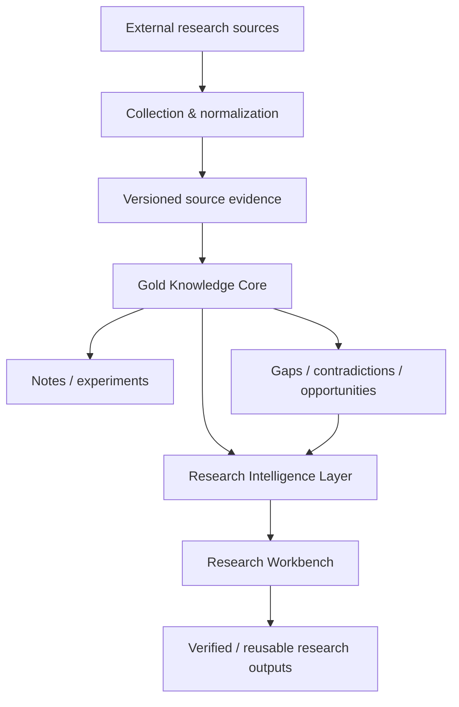
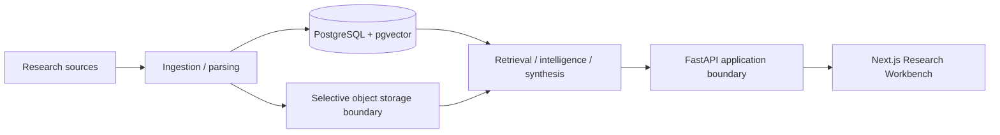

# Intel OS — Public Architecture Overview

This document describes the **disclosure-safe architecture** of Intel OS. It intentionally omits proprietary implementation details, internal scoring/reasoning rules, private schemas, operational secrets and detailed security paths.

For project status and measured results, see [Public Progress & Verified Results](docs/PUBLIC_PROGRESS.md).

---

## 1. Architecture goal

Intel OS is designed to preserve research intelligence over time rather than optimize for one model, one chat session or one paper summary.

The central architectural principle is:

> **Centralize intelligence, not necessarily every raw byte.**

The durable system should preserve enough structured context to answer:

- What source did this information come from?
- Which source version was used?
- What evidence supports a claim?
- Is the statement source-supported, contested, unassessed or otherwise uncertain?
- What later gap, opportunity, idea, note or output depended on it?

---

## 2. Three-layer model



### Tier A — Gold Knowledge Core

The authoritative long-lived research asset. At a public level, it contains concepts such as:

- scholarly/source identity;
- versioned document snapshots;
- grounded evidence and extracted claims;
- explicit epistemic state;
- research notes and experiment records;
- contradiction/gap/opportunity/idea entities;
- backward provenance and lineage.

The system preserves source observations rather than silently collapsing them into an unquestioned notion of truth.

### Tier B — Research Intelligence Layer

This layer retrieves, connects and analyzes the knowledge core to support:

- lexical + semantic evidence retrieval;
- provenance-aware context construction;
- contradiction visibility;
- gap/opportunity surfacing;
- research-memory reuse;
- citation-grounded synthesis.

A strong retrieval score or grounded answer is still **not automatically scientific truth**.

### Tier C — Research Workbench

The user-facing layer supports:

- dashboard/status views;
- evidence search and exploration;
- document/source/version inspection;
- provenance and idea-lineage exploration;
- personal research memory;
- output generation;
- Learning Mode;
- Research Intelligence views.

The UI is a presentation/workflow layer. It does not become the authority merely because something is rendered on screen.

---

## 3. Provenance-first research model

Intel OS aims to preserve an inspectable chain such as:

```text
Idea
  ↓
Opportunity
  ↓
Gap / Contradiction
  ↓
Claim
  ↓
Evidence
  ↓
Snapshot / Source Version
  ↓
Document
  ↓
Source / Provider Observation
```

This provides a durable answer to *why* an idea or output exists and what research context it depended on.

Important distinction:

> **Grounding proves source presence, not scientific correctness.**

A quote can be reproduced exactly while the scientific claim itself remains uncertain, contested or wrong.

---

## 4. High-level technical shape

V1 follows a **modular-monolith** strategy rather than premature microservices.



Publicly reportable technology choices include:

| Area | V1 direction |
|---|---|
| Backend | Python / FastAPI modular monolith |
| Structured memory | PostgreSQL 16 |
| Semantic retrieval | pgvector |
| Frontend | Next.js / React |
| Raw artifact retention | Selective S3-compatible boundary |
| AI reasoning | Replaceable provider adapters |

Technology remains subordinate to purpose. A component is added only when it earns its operational and research complexity.

---

## 5. Two deployment modes

### PUBLIC_DEMO

A synthetic/stateless public mode intended for demonstration and evaluation.

Properties:

- no private research database requirement;
- no owner credentials;
- synthetic/demo-safe data only;
- disclosure-safe behavior;
- suitable for the public hosted preview.

### PRIVATE_LOCAL

The private owner workflow for authoritative research use.

Properties:

- private research context;
- protected backend/data boundary;
- persistent owner research memory;
- not remotely exposed by the public demo.

The two modes are intentionally explicit so that a public deployment cannot silently masquerade as the private authoritative research environment.

---

## 6. Epistemic boundaries

Intel OS keeps several concepts deliberately separate:

```text
source contains statement
        ≠
statement is scientifically true

retrieval rank
        ≠
truth confidence

semantic distance
        ≠
scientific novelty

system-generated gap / opportunity
        ≠
author-stated fact
```

This distinction is part of the architecture, not merely UI wording.

---

## 7. Reliability and release philosophy

Intel OS uses gate-based development:

```text
implementation
    ↓
automated tests
    ↓
evidence collection
    ↓
adversarial / mentor review
    ↓
approval or revision
```

A green CI run is required but cannot approve a gate by itself. Evidence must actually measure the claim it is being used to support.

Release hardening also includes reproducibility, owner-facing usability, recovery/backup thinking, public/private disclosure boundaries and archival readiness.

---

## 8. Public/private architecture boundary

The public repository intentionally publishes only enough architecture for meaningful academic, portfolio and engineering evaluation.

Detailed items remain private by default, including:

- live schemas and migrations beyond intentionally disclosed history;
- proprietary scoring/ranking implementation;
- prompt/orchestration internals;
- private evaluation fixtures;
- detailed security attack paths and countermeasure implementation;
- production operational configuration;
- private datasets and Research Memory;
- unpublished gaps, ideas, experiments and methods.

See [IP / Disclosure Policy](docs/IP_POLICY.md) for the governing repository boundary.
