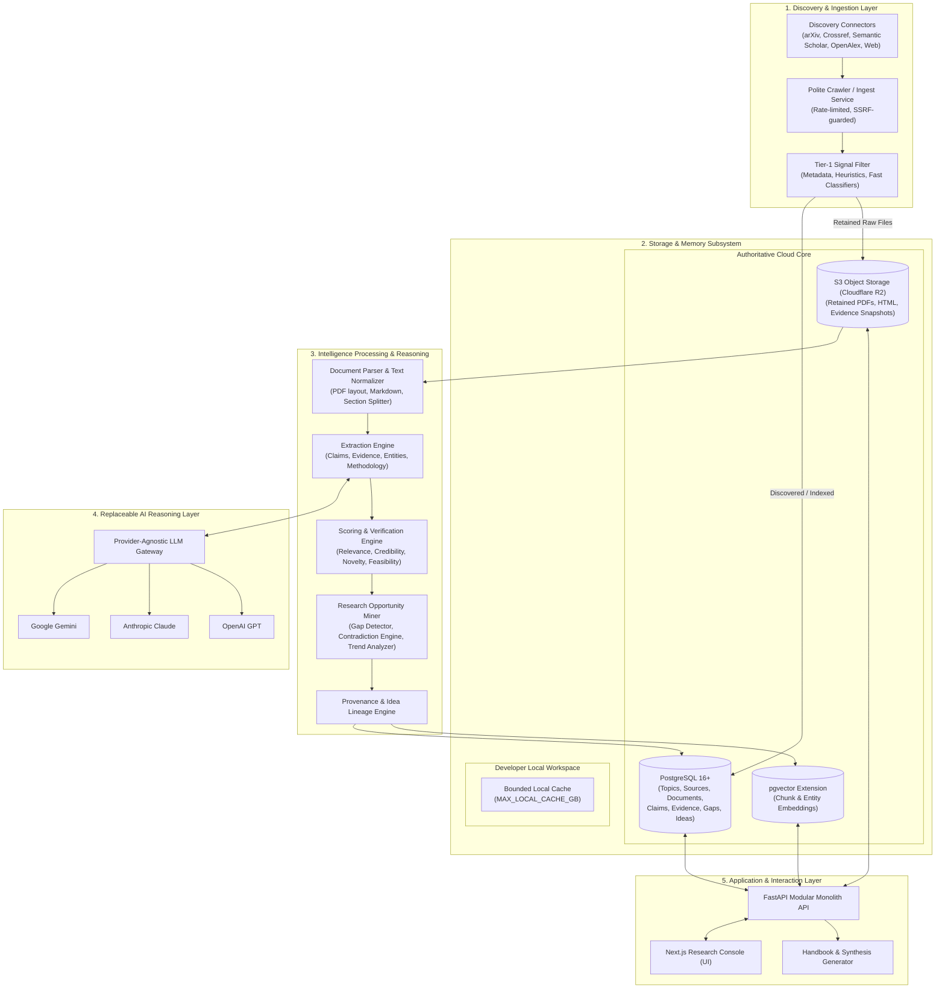
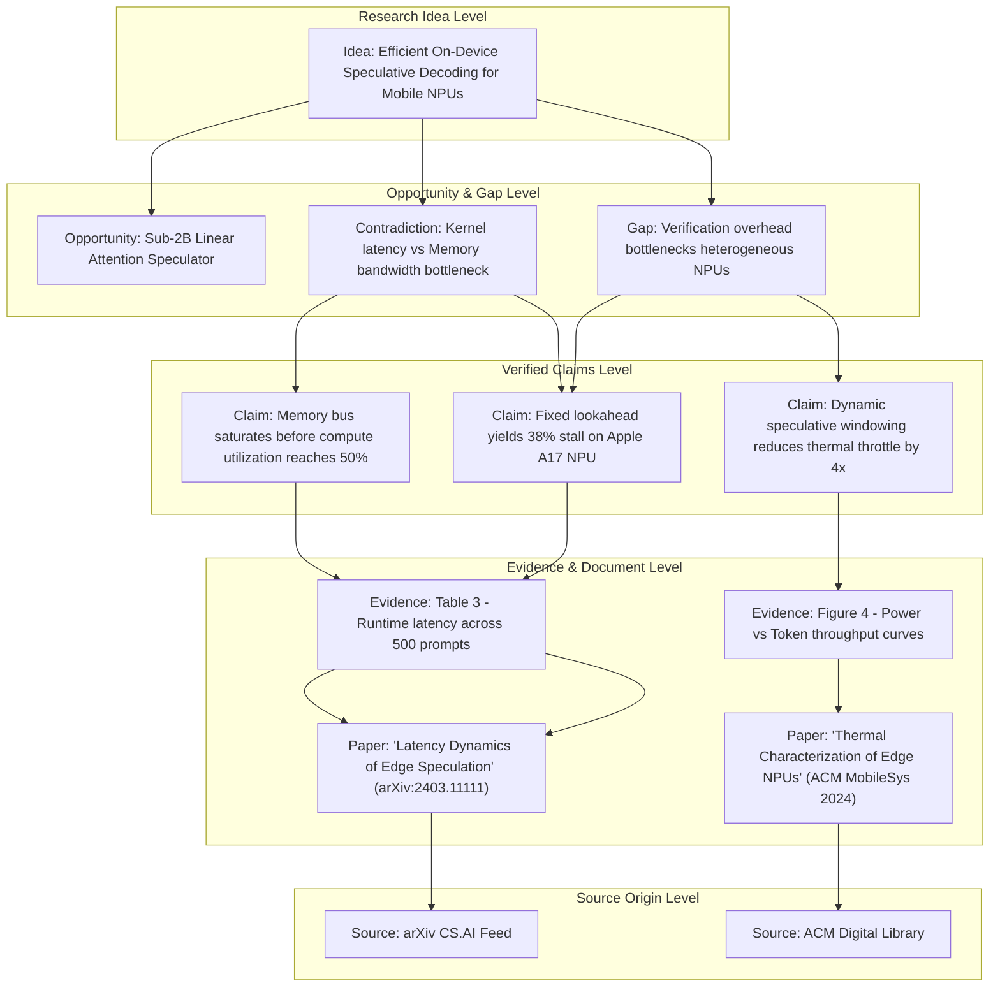

# Intel OS Architecture Overview

## 1. Architectural Philosophy

**Intel OS / NCKH Intelligence Platform** is built as a **Cloud-First Modular Monolith** designed for long-term personal research acceleration and scientific intelligence management.

The architectural design is governed by five non-negotiable principles:

1. **Durable Assets over Ephemeral Models**: Large Language Models are treated as replaceable computational engines. The true enduring value is the structured relational graph of verified claims, empirical evidence, research gaps, opportunities, and user insights.
2. **Strict Provenance & Lineage**: Every derived insight, hypothesis, research gap, or paper idea must trace backward to its underlying claims, supporting/contradicting evidence, source documents, and original discovery origin.
3. **Cloud-First Authoritative Truth**: The developer laptop is never the system of record. Local storage is strictly bounded (`MAX_LOCAL_CACHE_GB`) as a transient execution cache. The authoritative repository of intelligence resides in a cloud-hosted PostgreSQL database and S3-compatible object storage.
4. **Selective Tiered Retention**: Ingestion distinguishes discovery from deep retention. Not every discovered item requires permanent raw document storage. Raw evidence is retained only when passing value, relevance, and reproducibility thresholds.
5. **Idempotency & Observability by Default**: All background ingestion, normalization, and analysis jobs are idempotent, trackable, and verifiable through transactional telemetry.

---

## 2. High-Level System Architecture



---

## 3. The Three Long-Lived Intellectual Assets

Intel OS manages three primary intellectual assets, designed to persist across decades of research:

### Asset 1: The Intelligence Lake
* **Function**: Indexes and organizes all discovered source material, filtering raw data into curated knowledge tiers.
* **Retention Hierarchy**:
  1. `DISCOVERED`: URL, DOI, title, publication venue, metadata hash (stored in PostgreSQL).
  2. `INDEXED`: Extracted abstract, normalized keywords, author affiliations, fast embeddings.
  3. `RELEVANT`: Full parsed text and structural sections (abstract, methodology, results, discussion).
  4. `RETAINED`: Original raw artifact (PDF, HTML snapshot) preserved in S3-compatible storage.
  5. `ARCHIVED`: Cold storage tier for reproducible long-term project checkpoints.
* **Key Invariant**: Discovery does not imply raw file retention. Metadata-only retention prevents storage bloat.

### Asset 2: Personal Research Memory
* **Function**: The user's accumulated, verified scientific knowledge base and experimental narrative.
* **Key Components**:
  * **Verified Claims**: Atomic statements of fact, empirical findings, or theoretical assertions extracted with direct quote verification.
  * **Evidence Items**: Quantitative metrics, experimental setups, sample sizes, and statistical confidence levels linked to claims.
  * **Entity & Topic Relationships**: Cross-domain semantic links connecting methods, datasets, benchmarks, and problem spaces.
  * **Personal Research Notes**: User observations, critique notes, brainstorms, and evolving mental models.
  * **Experiment Logs & Failure Analysis**: Detailed records of failed attempts, negative results, and design lessons.

### Asset 3: Research Opportunity Memory
* **Function**: A proactive scientific discovery engine that uncovers, structures, and refines high-potential research directions.
* **Key Components**:
  * **Research Gaps**: Underexplored domains, missing evaluations, hardware bottlenecks, or methodological limitations.
  * **Scientific Contradictions**: Explicit discrepancies between findings across different publications.
  * **Emerging Trends**: Trajectories identified across recent preprint releases, funding shifts, and citation momentum.
  * **Candidate Ideas & Hypotheses**: Novel solution proposals generated with explicit feasibility, resource cost, and novelty assessments.
  * **Idea Lineage**: Complete backward provenance graph explaining *why* an idea was proposed.

---

## 4. Flagship Provenance: Idea Lineage Graph

Intel OS guarantees complete traceability for all generated insights and proposals.



---

## 5. Storage Topology & Cloud-First Principles

```
┌─────────────────────────────────────────────────────────────────────────────┐
│                          STORAGE TOPOLOGY & ROLES                           │
├────────────────────────────────┬────────────────────────────────────────────┤
│ Storage Tier                   │ Authoritative Responsibility               │
├────────────────────────────────┼────────────────────────────────────────────┤
│ PostgreSQL 16+ (Primary DB)    │ Authoritative source of truth for:         │
│                                │ • Topics, Sources, Documents               │
│                                │ • Claims, Evidence, Relationships          │
│                                │ • Research Gaps, Opportunities, Ideas      │
│                                │ • User Notes, Experiments, Job Logs        │
├────────────────────────────────┼────────────────────────────────────────────┤
│ pgvector (Extension)           │ Semantic retrieval vectors for:            │
│                                │ • Document chunks, Claim embeddings        │
│                                │ • Opportunity & Gap semantic clustering    │
├────────────────────────────────┼────────────────────────────────────────────┤
│ S3 Object Storage (R2/MinIO)   │ Durable artifact storage for:              │
│                                │ • High-value raw PDFs and HTML snapshots   │
│                                │ • Extracted tables, charts, figures        │
│                                │ • Cold dataset dumps and exports           │
├────────────────────────────────┼────────────────────────────────────────────┤
│ Developer Laptop (Local)       │ Transient execution environment:           │
│                                │ • Source code & test fixtures              │
│                                │ • Temporary parsing buffer                 │
│                                │ • Bounded cache (MAX_LOCAL_CACHE_GB = 10G) │
├────────────────────────────────┼────────────────────────────────────────────┤
│ External HDD (Cold Archive)    │ Disaster recovery & offline archives:      │
│                                │ • Monthly database dump archives           │
│                                │ • Large historical benchmark datasets      │
│                                │ (Never used as the active PostgreSQL host) │
└────────────────────────────────┴────────────────────────────────────────────┘
```

---

## 6. Technology Stack Justification

| Component | Selected Technology | Architectural Justification |
| :--- | :--- | :--- |
| **Backend Framework** | **FastAPI (Python 3.11+)** | High-performance asynchronous REST endpoints, native Pydantic schema validation, mature ecosystem for scientific document parsing (PyPDF, pdfplumber, BeautifulSoup). |
| **ORM / Data Access** | **SQLAlchemy 2.0 (Async) + asyncpg** | Robust relational mapping, explicit transaction boundaries, async query execution, direct compatibility with pgvector. |
| **Database** | **PostgreSQL 16+** | Industry standard for relational integrity, JSONB support for flexible metadata, ACID compliance for research memory. |
| **Vector Engine** | **pgvector** | Colocates vector embeddings inside PostgreSQL. Eliminates dual-database synchronization complexity, allows unified SQL filtering on metadata and vector similarity. |
| **Object Store** | **S3-Compatible (Cloudflare R2)** | Standard S3 API, zero egress fees with Cloudflare R2, multi-region redundancy for raw research artifacts. |
| **Frontend UI** | **Next.js 15+ (App Router)** | High-performance server-rendered UI, TypeScript type safety, fluid responsive design for research exploration. |
| **Styling** | **Modern Vanilla CSS & Tokens** | Clean, fast, zero-runtime overhead, fully custom research console aesthetics without bloated utility layers. |
| **Queue & Workers** | **Asynchronous Job Worker** | Background scraping, parsing, and LLM extraction with Redis or PostgreSQL-backed task queues ensuring idempotency. |

---

## 7. Next Steps & Detailed Architecture

For granular technical specifications, refer to:
* [Detailed Architecture](docs/ARCHITECTURE_DETAILED.md)
* [Relational & Vector Data Model](docs/DATA_MODEL.md)
* [Ingestion & Processing Pipeline](docs/PIPELINE.md)
* [Security & Sandboxing Model](docs/SECURITY_MODEL.md)
* [Multi-Factor Scoring Model](docs/SCORING_MODEL.md)
* [Intelligence & Epistemic Ontology](docs/INTELLIGENCE_MODEL.md)
