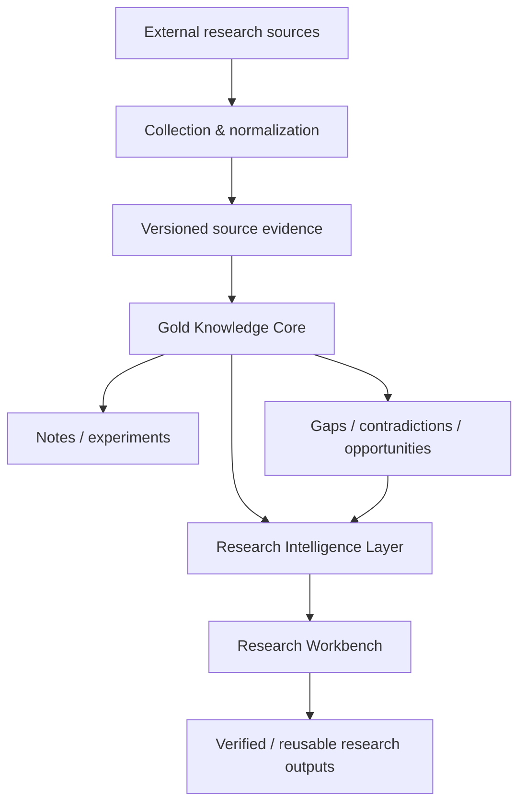
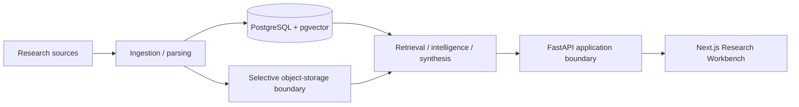

# Intel OS — Public Architecture Overview

This document describes the **disclosure-safe architecture** of Intel OS. It intentionally omits proprietary implementation details, internal scoring/reasoning rules, private schemas, operational secrets and detailed security paths.

For current status and measured results, see [Public Progress & Verified Results](docs/PUBLIC_PROGRESS.md).

---

## 1. Architecture goal

Intel OS is designed to preserve research intelligence over time rather than optimize for one model, one chat session or one paper summary.

The central architectural principle is:

> **Centralize intelligence, not necessarily every raw byte.**

The durable system should preserve enough structured context to answer:

- What source did this information come from?
- Which source version was used?
- What evidence supports a claim?
- Is the statement source-supported, contested, unassessed or otherwise uncertain?
- What later gap, opportunity, idea, note or output depended on it?

---

## 2. Three-layer model


```mermaid
flowchart TB
    A[External research sources] --> B[Collection & normalization]
    B --> C[Versioned source evidence]
    C --> D[Gold Knowledge Core]
    D --> E[Research Intelligence Layer]
    E --> F[Research Workbench]
    F --> G[Verified / reusable research outputs]

    D --> H[Notes / experiments]
    D --> I[Gaps / contradictions / opportunities]
    I --> E
```

### Tier A — Gold Knowledge Core

The authoritative long-lived research asset. At a public level, it contains concepts such as:

- scholarly/source identity;
- versioned and immutable document snapshots;
- grounded evidence and structured claims;
- explicit epistemic state;
- research notes and experiment records;
- contradiction/gap/opportunity/idea entities;
- backward provenance and lineage.

The system preserves source observations rather than silently collapsing them into an unquestioned notion of truth.

### Tier B — Research Intelligence Layer

This layer retrieves, connects and analyzes the knowledge core to support:

- lexical + semantic evidence retrieval;
- provenance-aware context construction;
- contradiction visibility;
- gap/opportunity surfacing;
- research-memory reuse;
- citation-grounded synthesis.

A strong retrieval score or grounded answer is still **not automatically scientific truth**.

### Tier C — Research Workbench

The user-facing layer supports:

- Research Intelligence command-center views;
- evidence search and exploration;
- document/source/version inspection;
- provenance and idea-lineage exploration;
- personal research memory;
- controlled output generation;
- Learning Mode;
- contextual research inspection;
- bilingual Vietnamese / English presentation.

The UI is a presentation/workflow layer. It does not become the authority merely because something is rendered on screen.

---

## 3. Provenance-first research model

Intel OS preserves direct source/evidence provenance separately from higher-level research intelligence.

A bounded direct evidence chain can look like:

```text
Document
  ↓
Immutable Snapshot / Source Version
  ↓
Claim
```

Higher-level research relationships may extend through contradictions, gaps, opportunities, ideas and outputs **only when the corresponding relationship is explicitly supported by system state**.

This distinction matters. A gap appearing in the same research context does not automatically mean a claim caused, surfaced or supports that gap.

Longer research lineage may include relationships such as:

```text
Idea → Opportunity → Gap / Contradiction → Claim → Evidence → Snapshot → Document → Source
```

but this is a conceptual lineage target, not permission to infer missing edges.

> **Grounding proves source presence, not scientific correctness.**

A quote can be reproduced exactly while the scientific claim itself remains uncertain, contested or wrong.

---

## 4. High-level technical shape

V1 follows a **cloud-first modular-monolith** strategy rather than premature microservices.


```mermaid
flowchart LR
    S[Research sources] --> I[Ingestion / parsing]
    I --> P[(PostgreSQL + pgvector)]
    I --> O[Selective object-storage boundary]
    P --> R[Retrieval / intelligence / synthesis]
    O --> R
    R --> A[FastAPI application boundary]
    A --> W[Next.js Research Workbench]
```

Publicly reportable technology choices include:

| Area | V1 direction |
|---|---|
| Backend | Python / FastAPI modular monolith |
| Structured memory | PostgreSQL 16 |
| Semantic retrieval | pgvector |
| Frontend | Next.js / React |
| Raw artifact retention | Selective S3-compatible boundary |
| AI reasoning | Replaceable provider adapters |

Technology remains subordinate to purpose. A component is added only when it earns its operational and research complexity.

---

## 5. PUBLIC_DEMO and PRIVATE_LOCAL

### PUBLIC_DEMO

A synthetic/stateless public mode intended for demonstration and evaluation.

Properties:

- no private research database requirement;
- no owner credentials;
- synthetic/demo-safe data only;
- disclosure-safe behavior;
- deterministic bounded fixture for public evaluation;
- suitable for the hosted public preview.

The production public demo deliberately exposes a small evidence context rather than pretending to be a live scientific knowledge base.

### PRIVATE_LOCAL

The private owner workflow for authoritative research use.

Properties:

- private research context;
- protected backend/data boundary;
- persistent owner research memory;
- private retained artifacts and research state;
- not remotely exposed by the public demo.

The modes are explicit so that a hosted demo cannot silently masquerade as the private authoritative research environment.

---

## 6. V1.0.3 Research Workbench composition

The current public workbench is organized as a research command center rather than a generic KPI dashboard.

```text
Research object / query
        ↓
Knowledge Landscape / Provenance Canvas
        ↓
selected object + relevant path emphasis
        ↓
Contextual Inspector
        ↓
real bounded actions
```

Disclosure-safe interface concepts include:

- asymmetric command-center composition;
- Knowledge Landscape / Provenance interaction;
- direct path emphasis for supported lineage;
- contextual object inspection;
- command/search surface for real routes/actions;
- mobile contextual sheet with keyboard focus management;
- `prefers-reduced-motion` handling;
- Vietnamese-first UI with coherent English mode.

Locale switching is presentation-only: it must not change document identity, context identity, graph relationships or machine epistemic state.

---

## 7. Epistemic boundaries

Intel OS keeps several concepts deliberately separate:

```text
source contains statement
        ≠
statement is scientifically true

retrieval rank
        ≠
truth confidence

semantic distance
        ≠
scientific novelty

system-generated gap / opportunity
        ≠
author-stated fact

co-presence in one research context
        ≠
a proven relationship
```

This distinction is part of the architecture, not merely UI wording.

---

## 8. Reliability, recovery and release philosophy

Intel OS uses gate-based development:

```text
implementation
    ↓
automated tests
    ↓
evidence collection
    ↓
adversarial / mentor review
    ↓
approval or revision
```

A green CI run is required but cannot approve a gate by itself. Evidence must actually measure the claim it is being used to support.

The completed V1 release path also verifies:

- PostgreSQL migration lifecycle;
- deterministic startup/reproducibility probes;
- native backup + disposable restore proof;
- security regression packs;
- release-manifest integrity;
- owner-facing acceptance;
- final release-identity verification.

The current V1.0.3 patch changes the user-facing workbench and localization while intentionally preserving the approved backend/research-core boundaries.

---

## 9. V1 → V2 evolution boundary

V1 answers primarily:

> **What do we know, where did it come from, and can we reuse it safely?**

A future V2 direction is the **Distributed Research Data Fabric**, intended to add location awareness for research assets and compute while preserving one coherent intelligence layer.

Conceptually:

```text
V1: understand knowledge
V2: understand where research assets and compute live
V3: coordinate intelligence across locations
```

V2 is a planned direction, **not a claim about the current production system**.

---

## 10. Public/private architecture boundary

The public repository intentionally publishes enough architecture for meaningful academic, portfolio and engineering evaluation without becoming an installable mirror of the proprietary core.

Detailed items remain private by default, including:

- live schemas and migrations beyond intentionally disclosed history;
- proprietary scoring/ranking implementation;
- prompt/orchestration internals;
- private evaluation fixtures and detailed evidence;
- detailed security attack paths and countermeasure implementation;
- production operational configuration;
- private datasets and Research Memory;
- unpublished gaps, ideas, experiments and methods.

See [IP / Disclosure Policy](docs/IP_POLICY.md) for the governing repository boundary.
