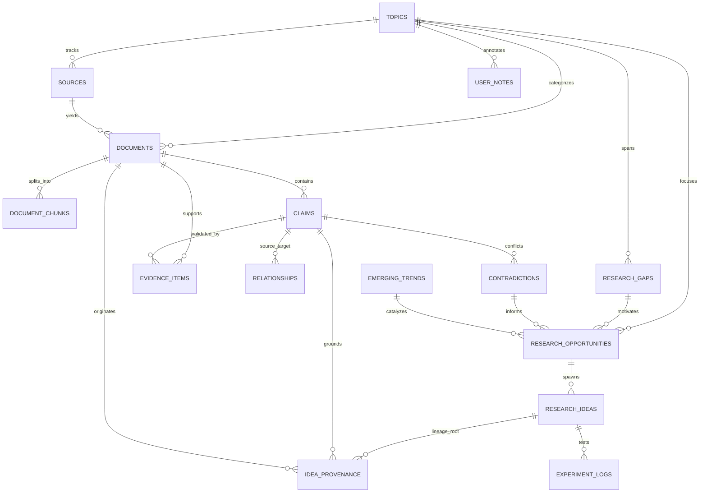

# Intel OS / NCKH Intelligence Platform — Data Model & Schema Specification

## 1. Entity-Relationship Overview



---

## 2. Retention Tiers & Status Enums

```sql
-- Retention tier for documents in Intelligence Lake
CREATE TYPE retention_tier AS ENUM (
    'DISCOVERED',   -- Metadata only (Title, DOI, Authors, Venue, URL)
    'INDEXED',      -- Metadata + Abstract + Fast topic embeddings
    'RELEVANT',     -- Full parsed text & structural sections
    'RETAINED',     -- Raw PDF/HTML preserved in S3 Object Storage
    'ARCHIVED'      -- Deep cold storage backup
);

-- Epistemic status of extracted scientific claims
CREATE TYPE epistemic_status AS ENUM (
    'HYPOTHESIS',   -- Author proposition without complete validation
    'SUPPORTED',    -- Supported by explicit empirical evidence in text
    'CONTRADICTED', -- Challenged by another peer-reviewed finding
    'REFUTED',      -- Empirically disproven
    'CONSENSUS',    -- Broadly accepted foundational fact
    'SPECULATION'   -- Future outlook / untested conjecture
);

-- Idea status in Opportunity Bank
CREATE TYPE idea_status AS ENUM (
    'CANDIDATE',    -- Automatically generated proposal
    'REVIEWED',     -- Evaluated by human researcher
    'ACCEPTED',     -- Approved for active research / paper authoring
    'REJECTED',     -- Deemed infeasible or duplicate
    'ARCHIVED'      -- Historical reference
);

-- Background job status
CREATE TYPE job_status AS ENUM (
    'PENDING',
    'RUNNING',
    'COMPLETED',
    'FAILED',
    'RETRYING'
);
```

---

## 3. PostgreSQL 16+ Relational DDL (with pgvector)

```sql
-- Ensure pgvector extension is enabled
CREATE EXTENSION IF NOT EXISTS vector;
CREATE EXTENSION IF NOT EXISTS "uuid-ossp";

-- =============================================================================
-- 1. Topics (Research Areas & Domains)
-- =============================================================================
CREATE TABLE topics (
    id UUID PRIMARY KEY DEFAULT uuid_generate_v4(),
    name VARCHAR(255) NOT NULL UNIQUE,
    slug VARCHAR(255) NOT NULL UNIQUE,
    description TEXT,
    keywords TEXT[] NOT NULL DEFAULT '{}',
    is_active BOOLEAN NOT NULL DEFAULT TRUE,
    created_at TIMESTAMPTZ NOT NULL DEFAULT NOW(),
    updated_at TIMESTAMPTZ NOT NULL DEFAULT NOW()
);

-- =============================================================================
-- 2. Sources (Crawl Targets, Feeds, Repositories)
-- =============================================================================
CREATE TABLE sources (
    id UUID PRIMARY KEY DEFAULT uuid_generate_v4(),
    topic_id UUID REFERENCES topics(id) ON DELETE SET NULL,
    name VARCHAR(255) NOT NULL,
    source_type VARCHAR(50) NOT NULL, -- 'ARXIV', 'CROSSREF', 'SEMANTIC_SCHOLAR', 'WEB'
    base_url TEXT NOT NULL,
    feed_url TEXT,
    config JSONB NOT NULL DEFAULT '{}'::jsonb,
    is_active BOOLEAN NOT NULL DEFAULT TRUE,
    last_crawled_at TIMESTAMPTZ,
    created_at TIMESTAMPTZ NOT NULL DEFAULT NOW(),
    updated_at TIMESTAMPTZ NOT NULL DEFAULT NOW()
);

-- =============================================================================
-- 3. Documents (Papers, Articles, Preprints in Intelligence Lake)
-- =============================================================================
CREATE TABLE documents (
    id UUID PRIMARY KEY DEFAULT uuid_generate_v4(),
    topic_id UUID NOT NULL REFERENCES topics(id) ON DELETE CASCADE,
    source_id UUID REFERENCES sources(id) ON DELETE SET NULL,
    doi VARCHAR(255) UNIQUE,
    arxiv_id VARCHAR(100) UNIQUE,
    url TEXT NOT NULL,
    canonical_url TEXT NOT NULL,
    content_hash VARCHAR(64) NOT NULL UNIQUE, -- SHA-256
    title TEXT NOT NULL,
    authors TEXT[] NOT NULL DEFAULT '{}',
    publication_venue VARCHAR(255),
    publication_date DATE,
    abstract TEXT,
    raw_s3_key TEXT, -- Location in S3 if RETAINED tier
    retention_tier retention_tier NOT NULL DEFAULT 'DISCOVERED',
    relevance_score FLOAT NOT NULL DEFAULT 0.0,
    credibility_score FLOAT NOT NULL DEFAULT 0.0,
    metadata JSONB NOT NULL DEFAULT '{}'::jsonb,
    created_at TIMESTAMPTZ NOT NULL DEFAULT NOW(),
    updated_at TIMESTAMPTZ NOT NULL DEFAULT NOW()
);

CREATE INDEX idx_documents_topic_id ON documents(topic_id);
CREATE INDEX idx_documents_retention_tier ON documents(retention_tier);
CREATE INDEX idx_documents_content_hash ON documents(content_hash);
CREATE INDEX idx_documents_doi ON documents(doi);

-- =============================================================================
-- 4. Document Chunks & Vector Index
-- =============================================================================
CREATE TABLE document_chunks (
    id UUID PRIMARY KEY DEFAULT uuid_generate_v4(),
    document_id UUID NOT NULL REFERENCES documents(id) ON DELETE CASCADE,
    chunk_index INT NOT NULL,
    section_name VARCHAR(100), -- 'ABSTRACT', 'METHODOLOGY', 'RESULTS', etc.
    content TEXT NOT NULL,
    token_count INT NOT NULL,
    embedding vector(768), -- pgvector embedding (768 for Gemini)
    created_at TIMESTAMPTZ NOT NULL DEFAULT NOW(),
    UNIQUE(document_id, chunk_index)
);

CREATE INDEX idx_document_chunks_document_id ON document_chunks(document_id);
CREATE INDEX idx_document_chunks_embedding_hnsw ON document_chunks USING hnsw (embedding vector_cosine_ops);

-- =============================================================================
-- 5. Verified Scientific Claims (Personal Research Memory Core)
-- =============================================================================
CREATE TABLE claims (
    id UUID PRIMARY KEY DEFAULT uuid_generate_v4(),
    document_id UUID NOT NULL REFERENCES documents(id) ON DELETE CASCADE,
    topic_id UUID NOT NULL REFERENCES topics(id) ON DELETE CASCADE,
    claim_text TEXT NOT NULL,
    normalized_statement TEXT NOT NULL,
    quote_verbatim TEXT NOT NULL, -- Exact grounding quote from paper
    quote_start_char INT,
    quote_end_char INT,
    epistemic_status epistemic_status NOT NULL DEFAULT 'SUPPORTED',
    confidence_score FLOAT NOT NULL DEFAULT 1.0,
    verification_method VARCHAR(100),
    embedding vector(768),
    created_at TIMESTAMPTZ NOT NULL DEFAULT NOW(),
    updated_at TIMESTAMPTZ NOT NULL DEFAULT NOW()
);

CREATE INDEX idx_claims_document_id ON claims(document_id);
CREATE INDEX idx_claims_topic_id ON claims(topic_id);
CREATE INDEX idx_claims_epistemic_status ON claims(epistemic_status);
CREATE INDEX idx_claims_embedding_hnsw ON claims USING hnsw (embedding vector_cosine_ops);

-- =============================================================================
-- 6. Evidence Items (Empirical Grounding)
-- =============================================================================
CREATE TABLE evidence_items (
    id UUID PRIMARY KEY DEFAULT uuid_generate_v4(),
    claim_id UUID NOT NULL REFERENCES claims(id) ON DELETE CASCADE,
    document_id UUID NOT NULL REFERENCES documents(id) ON DELETE CASCADE,
    evidence_type VARCHAR(50) NOT NULL, -- 'BENCHMARK', 'STATISTICAL_RESULT', 'QUALITATIVE', 'ABLATION'
    dataset_name VARCHAR(255),
    hardware_setup VARCHAR(255),
    sample_size INT,
    metric_name VARCHAR(100),
    metric_value FLOAT,
    baseline_value FLOAT,
    statistical_significance VARCHAR(50), -- e.g. 'p < 0.01'
    table_figure_ref VARCHAR(100),
    created_at TIMESTAMPTZ NOT NULL DEFAULT NOW()
);

CREATE INDEX idx_evidence_claim_id ON evidence_items(claim_id);
CREATE INDEX idx_evidence_document_id ON evidence_items(document_id);

-- =============================================================================
-- 7. Relationships (Entity, Claim & Concept Graph)
-- =============================================================================
CREATE TABLE relationships (
    id UUID PRIMARY KEY DEFAULT uuid_generate_v4(),
    source_claim_id UUID REFERENCES claims(id) ON DELETE CASCADE,
    target_claim_id UUID REFERENCES claims(id) ON DELETE CASCADE,
    relation_type VARCHAR(50) NOT NULL, -- 'SUPPORTS', 'CONTRADICTS', 'EXTENDS', 'REFUTES', 'DEPENDS_ON'
    explanation TEXT,
    weight FLOAT NOT NULL DEFAULT 1.0,
    created_at TIMESTAMPTZ NOT NULL DEFAULT NOW()
);

CREATE INDEX idx_relationships_source_claim ON relationships(source_claim_id);
CREATE INDEX idx_relationships_target_claim ON relationships(target_claim_id);
CREATE INDEX idx_relationships_type ON relationships(relation_type);

-- =============================================================================
-- 8. Research Gaps & Scientific Contradictions
-- =============================================================================
CREATE TABLE research_gaps (
    id UUID PRIMARY KEY DEFAULT uuid_generate_v4(),
    topic_id UUID NOT NULL REFERENCES topics(id) ON DELETE CASCADE,
    title VARCHAR(255) NOT NULL,
    description TEXT NOT NULL,
    primary_limitation TEXT NOT NULL,
    gap_score FLOAT NOT NULL DEFAULT 0.0,
    is_resolved BOOLEAN NOT NULL DEFAULT FALSE,
    created_at TIMESTAMPTZ NOT NULL DEFAULT NOW(),
    updated_at TIMESTAMPTZ NOT NULL DEFAULT NOW()
);

CREATE TABLE contradictions (
    id UUID PRIMARY KEY DEFAULT uuid_generate_v4(),
    topic_id UUID NOT NULL REFERENCES topics(id) ON DELETE CASCADE,
    claim_a_id UUID NOT NULL REFERENCES claims(id) ON DELETE CASCADE,
    claim_b_id UUID NOT NULL REFERENCES claims(id) ON DELETE CASCADE,
    contradiction_summary TEXT NOT NULL,
    severity_score FLOAT NOT NULL DEFAULT 0.0,
    is_resolved BOOLEAN NOT NULL DEFAULT FALSE,
    created_at TIMESTAMPTZ NOT NULL DEFAULT NOW()
);

-- =============================================================================
-- 9. Research Opportunities & Ideas (Opportunity Memory)
-- =============================================================================
CREATE TABLE research_opportunities (
    id UUID PRIMARY KEY DEFAULT uuid_generate_v4(),
    topic_id UUID NOT NULL REFERENCES topics(id) ON DELETE CASCADE,
    research_gap_id UUID REFERENCES research_gaps(id) ON DELETE SET NULL,
    contradiction_id UUID REFERENCES contradictions(id) ON DELETE SET NULL,
    title VARCHAR(255) NOT NULL,
    opportunity_statement TEXT NOT NULL,
    novelty_score FLOAT NOT NULL DEFAULT 0.0,
    feasibility_score FLOAT NOT NULL DEFAULT 0.0,
    priority_score FLOAT NOT NULL DEFAULT 0.0,
    created_at TIMESTAMPTZ NOT NULL DEFAULT NOW(),
    updated_at TIMESTAMPTZ NOT NULL DEFAULT NOW()
);

CREATE TABLE research_ideas (
    id UUID PRIMARY KEY DEFAULT uuid_generate_v4(),
    opportunity_id UUID NOT NULL REFERENCES research_opportunities(id) ON DELETE CASCADE,
    topic_id UUID NOT NULL REFERENCES topics(id) ON DELETE CASCADE,
    title VARCHAR(255) NOT NULL,
    hypothesis TEXT NOT NULL,
    proposed_methodology TEXT NOT NULL,
    estimated_resource_cost TEXT,
    status idea_status NOT NULL DEFAULT 'CANDIDATE',
    embedding vector(768),
    created_at TIMESTAMPTZ NOT NULL DEFAULT NOW(),
    updated_at TIMESTAMPTZ NOT NULL DEFAULT NOW()
);

-- =============================================================================
-- 10. Idea Lineage & Provenance Chain (Flagship Provenance)
-- =============================================================================
CREATE TABLE idea_provenance (
    id UUID PRIMARY KEY DEFAULT uuid_generate_v4(),
    idea_id UUID NOT NULL REFERENCES research_ideas(id) ON DELETE CASCADE,
    opportunity_id UUID REFERENCES research_opportunities(id) ON DELETE SET NULL,
    gap_id UUID REFERENCES research_gaps(id) ON DELETE SET NULL,
    claim_id UUID REFERENCES claims(id) ON DELETE SET NULL,
    document_id UUID NOT NULL REFERENCES documents(id) ON DELETE CASCADE,
    provenance_role VARCHAR(50) NOT NULL, -- 'FOUNDATIONAL', 'GAP_EVIDENCE', 'CONTRADICTION_A', 'CONTRADICTION_B', 'BENCHMARK_BASELINE'
    notes TEXT,
    created_at TIMESTAMPTZ NOT NULL DEFAULT NOW()
);

CREATE INDEX idx_idea_provenance_idea_id ON idea_provenance(idea_id);
CREATE INDEX idx_idea_provenance_document_id ON idea_provenance(document_id);
CREATE INDEX idx_idea_provenance_claim_id ON idea_provenance(claim_id);

-- =============================================================================
-- 11. Personal Research Notes & Experiment Logs
-- =============================================================================
CREATE TABLE user_notes (
    id UUID PRIMARY KEY DEFAULT uuid_generate_v4(),
    topic_id UUID NOT NULL REFERENCES topics(id) ON DELETE CASCADE,
    document_id UUID REFERENCES documents(id) ON DELETE SET NULL,
    claim_id UUID REFERENCES claims(id) ON DELETE SET NULL,
    title VARCHAR(255) NOT NULL,
    body TEXT NOT NULL,
    tags TEXT[] NOT NULL DEFAULT '{}',
    created_at TIMESTAMPTZ NOT NULL DEFAULT NOW(),
    updated_at TIMESTAMPTZ NOT NULL DEFAULT NOW()
);

CREATE TABLE experiment_logs (
    id UUID PRIMARY KEY DEFAULT uuid_generate_v4(),
    idea_id UUID NOT NULL REFERENCES research_ideas(id) ON DELETE CASCADE,
    experiment_name VARCHAR(255) NOT NULL,
    setup_description TEXT NOT NULL,
    results_summary TEXT NOT NULL,
    did_succeed BOOLEAN NOT NULL,
    lessons_learned TEXT,
    created_at TIMESTAMPTZ NOT NULL DEFAULT NOW()
);

-- =============================================================================
-- 12. Background Jobs & Telemetry
-- =============================================================================
CREATE TABLE background_jobs (
    id UUID PRIMARY KEY DEFAULT uuid_generate_v4(),
    job_type VARCHAR(100) NOT NULL,
    idempotency_key VARCHAR(128) NOT NULL UNIQUE,
    status job_status NOT NULL DEFAULT 'PENDING',
    progress_percentage FLOAT NOT NULL DEFAULT 0.0,
    payload JSONB NOT NULL DEFAULT '{}'::jsonb,
    result JSONB,
    error_message TEXT,
    attempts INT NOT NULL DEFAULT 0,
    max_attempts INT NOT NULL DEFAULT 3,
    started_at TIMESTAMPTZ,
    completed_at TIMESTAMPTZ,
    created_at TIMESTAMPTZ NOT NULL DEFAULT NOW()
);

CREATE INDEX idx_background_jobs_idempotency_key ON background_jobs(idempotency_key);
CREATE INDEX idx_background_jobs_status ON background_jobs(status);
```

---

## 4. Lineage Traversal Query: Full Backward Traceability

This recursive query reconstructs the full provenance tree for any given `research_idea`:

```sql
WITH RECURSIVE idea_lineage_tree AS (
    -- Anchor: The target research idea
    SELECT 
        ri.id AS idea_id,
        ri.title AS idea_title,
        ro.id AS opportunity_id,
        ro.title AS opportunity_title,
        rg.id AS gap_id,
        rg.title AS gap_title,
        c.id AS claim_id,
        c.claim_text AS claim_text,
        c.quote_verbatim AS evidence_quote,
        d.id AS document_id,
        d.title AS document_title,
        d.doi AS document_doi,
        s.name AS source_name,
        ip.provenance_role AS role
    FROM research_ideas ri
    JOIN idea_provenance ip ON ri.id = ip.idea_id
    LEFT JOIN research_opportunities ro ON ip.opportunity_id = ro.id
    LEFT JOIN research_gaps rg ON ip.gap_id = rg.id
    LEFT JOIN claims c ON ip.claim_id = c.id
    LEFT JOIN documents d ON ip.document_id = d.id
    LEFT JOIN sources s ON d.source_id = s.id
    WHERE ri.id = 'YOUR_RESEARCH_IDEA_UUID'
)
SELECT * FROM idea_lineage_tree;
```
