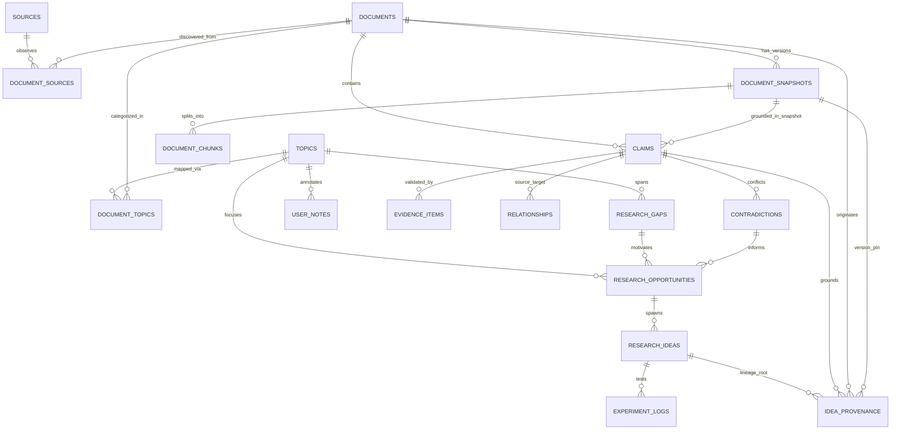

# Intel OS / NCKH Intelligence Platform — Data Model & Schema Specification

## 1. Entity-Relationship Overview



---

## 2. Enumerations & Status Types

```sql
-- Retention tier for documents & snapshots in Intelligence Lake
CREATE TYPE retention_tier AS ENUM (
    'DISCOVERED',   -- Metadata only (Title, DOI, Authors, Venue, Canonical URL)
    'INDEXED',      -- Metadata + Abstract + Fast topic embeddings
    'RELEVANT',     -- Full parsed text & structural sections
    'RETAINED',     -- Raw PDF/HTML preserved in S3 Object Storage
    'ARCHIVED'      -- Deep cold storage backup
);

-- Grounding status: Verifies text presence in source, NOT scientific validity
CREATE TYPE grounding_status AS ENUM (
    'UNVERIFIED',           -- Extracted claim has not completed quote verification
    'VERBATIM_MATCH',       -- Statement matches exact character substring in source text
    'PARAPHRASE_VERIFIED',  -- Statement semantic meaning verified against bounding quotes
    'FAILED'                -- Quote does not exist in source text (discarded/quarantined)
);

-- Claim type classification
CREATE TYPE claim_type AS ENUM (
    'EMPIRICAL_FINDING',    -- Quantitative/experimental result reported with data
    'AUTHOR_HYPOTHESIS',    -- Proposition formulated by author without full proof
    'BACKGROUND_ASSERTION', -- Stated as prior literature or domain assumption
    'INTERPRETATION',       -- Author qualitative deduction or explanation of results
    'LIMITATION',           -- Explicitly stated boundary condition or failure mode
    'FUTURE_WORK',          -- Suggested research direction or unexplored experiment
    'OTHER'                 -- Uncategorized statement
);

-- Epistemic status: Reflects scientific validity & consensus across literature
CREATE TYPE epistemic_status AS ENUM (
    'UNASSESSED',   -- Default upon extraction; no scientific truth judgment made yet
    'SUPPORTED',    -- Validated by rigorous methodology, empirical evidence, or replication
    'CONTESTED',    -- Direct conflicting finding or contradiction identified in literature
    'REFUTED',      -- Methodologically invalid, retracted, or empirically disproven
    'CONSENSUS',    -- Established scientific consensus across multiple independent studies
    'SPECULATIVE'   -- Untested hypothesis or theoretical conjecture
);

-- Idea status in Opportunity Bank
CREATE TYPE idea_status AS ENUM (
    'CANDIDATE',    -- Automatically generated proposal
    'REVIEWED',     -- Evaluated by human researcher
    'ACCEPTED',     -- Approved for active research / paper authoring
    'REJECTED',     -- Deemed infeasible or duplicate
    'ARCHIVED'      -- Historical reference
);

-- Background job execution status
CREATE TYPE job_status AS ENUM (
    'PENDING',
    'RUNNING',
    'COMPLETED',
    'FAILED',
    'RETRYING'
);
```

---

## 3. Versioned Embedding Model Contract for V1

* **V1 Embedding Contract**: All vector columns in the V1 schema (`document_chunks.embedding`, `claims.embedding`, `research_ideas.embedding`) strictly enforce **768 dimensions** (matching `text-embedding-004` / Gemini Embeddings / standard 768-dim models).
* **LLM Provider Independence**: Reasoning LLMs (Gemini, Claude, GPT) remain dynamically interchangeable via prompt adapters. Vector embeddings, however, conform to the active database contract dimension.
* **Future Embedding Migration Protocol**: Upgrading embedding models (e.g., to 1536-dim or 3072-dim) requires:
  1. Creating a versioned column or table (e.g., `document_chunks_v2` or `embedding_v2 vector(1536)`).
  2. Running an asynchronous backfill migration to compute new embeddings.
  3. Building new HNSW indexes.
  4. Swapping the active search query configuration.
  *(pgvector strictly rejects inserting vectors whose dimension does not match the column definition).*

---

## 4. PostgreSQL 16+ Authoritative DDL (18 Normalized Tables)

```sql
-- Ensure extensions are enabled
CREATE EXTENSION IF NOT EXISTS vector;
CREATE EXTENSION IF NOT EXISTS "uuid-ossp";

-- =============================================================================
-- 1. Topics (Research Areas & Domains)
-- =============================================================================
CREATE TABLE topics (
    id UUID PRIMARY KEY DEFAULT uuid_generate_v4(),
    name VARCHAR(255) NOT NULL UNIQUE,
    slug VARCHAR(255) NOT NULL UNIQUE,
    description TEXT,
    keywords TEXT[] NOT NULL DEFAULT '{}',
    is_active BOOLEAN NOT NULL DEFAULT TRUE,
    created_at TIMESTAMPTZ NOT NULL DEFAULT NOW(),
    updated_at TIMESTAMPTZ NOT NULL DEFAULT NOW()
);

-- =============================================================================
-- 2. Sources (Globally Reusable Ingestion Providers & Crawl Feeds)
-- =============================================================================
CREATE TABLE sources (
    id UUID PRIMARY KEY DEFAULT uuid_generate_v4(),
    name VARCHAR(255) NOT NULL UNIQUE,
    source_type VARCHAR(50) NOT NULL, -- 'ARXIV', 'CROSSREF', 'SEMANTIC_SCHOLAR', 'OPENALEX', 'WEB'
    base_url TEXT NOT NULL,
    feed_url TEXT,
    config JSONB NOT NULL DEFAULT '{}'::jsonb,
    is_active BOOLEAN NOT NULL DEFAULT TRUE,
    last_crawled_at TIMESTAMPTZ,
    created_at TIMESTAMPTZ NOT NULL DEFAULT NOW(),
    updated_at TIMESTAMPTZ NOT NULL DEFAULT NOW()
);

-- =============================================================================
-- 3. Documents (Logical Scientific Works / Papers)
-- =============================================================================
CREATE TABLE documents (
    id UUID PRIMARY KEY DEFAULT uuid_generate_v4(),
    doi VARCHAR(255) UNIQUE,
    arxiv_id VARCHAR(100) UNIQUE,
    canonical_url TEXT NOT NULL,
    metadata_fingerprint VARCHAR(64) NOT NULL, -- SHA-256 of normalized (title + authors + venue + year)
    title TEXT NOT NULL,
    authors TEXT[] NOT NULL DEFAULT '{}',
    publication_venue VARCHAR(255),
    publication_date DATE,
    abstract TEXT,
    retention_tier retention_tier NOT NULL DEFAULT 'DISCOVERED',
    relevance_score FLOAT NOT NULL DEFAULT 0.0,
    credibility_prior FLOAT NOT NULL DEFAULT 0.0, -- Heuristic source prior, NOT proof of claim truth
    metadata JSONB NOT NULL DEFAULT '{}'::jsonb,
    created_at TIMESTAMPTZ NOT NULL DEFAULT NOW(),
    updated_at TIMESTAMPTZ NOT NULL DEFAULT NOW()
);

CREATE INDEX idx_documents_doi ON documents(doi);
CREATE INDEX idx_documents_arxiv_id ON documents(arxiv_id);
CREATE INDEX idx_documents_metadata_fingerprint ON documents(metadata_fingerprint);
CREATE INDEX idx_documents_retention_tier ON documents(retention_tier);

-- =============================================================================
-- 4. Document Topics (Many-to-Many Relationship: Document <-> Topic)
-- =============================================================================
CREATE TABLE document_topics (
    id UUID PRIMARY KEY DEFAULT uuid_generate_v4(),
    document_id UUID NOT NULL REFERENCES documents(id) ON DELETE CASCADE,
    topic_id UUID NOT NULL REFERENCES topics(id) ON DELETE CASCADE,
    relevance_score FLOAT NOT NULL DEFAULT 0.0,
    assignment_method VARCHAR(50) NOT NULL DEFAULT 'MANUAL', -- 'KEYWORD_MATCH', 'SEMANTIC_SIMILARITY', 'MANUAL', 'CLASSIFIER'
    assigned_at TIMESTAMPTZ NOT NULL DEFAULT NOW(),
    UNIQUE(document_id, topic_id)
);

CREATE INDEX idx_document_topics_doc ON document_topics(document_id);
CREATE INDEX idx_document_topics_topic ON document_topics(topic_id);

-- =============================================================================
-- 5. Document Sources (Multi-Provider Observation Provenance)
-- =============================================================================
CREATE TABLE document_sources (
    id UUID PRIMARY KEY DEFAULT uuid_generate_v4(),
    document_id UUID NOT NULL REFERENCES documents(id) ON DELETE CASCADE,
    source_id UUID NOT NULL REFERENCES sources(id) ON DELETE CASCADE,
    provider_doc_id VARCHAR(255), -- ID in the provider system
    observed_url TEXT NOT NULL,
    observed_metadata JSONB NOT NULL DEFAULT '{}'::jsonb,
    observed_at TIMESTAMPTZ NOT NULL DEFAULT NOW(),
    UNIQUE(document_id, source_id, provider_doc_id)
);

CREATE INDEX idx_document_sources_doc ON document_sources(document_id);
CREATE INDEX idx_document_sources_source ON document_sources(source_id);

-- =============================================================================
-- 6. Document Snapshots (Fetched Representations / Version Snapshots)
-- =============================================================================
CREATE TABLE document_snapshots (
    id UUID PRIMARY KEY DEFAULT uuid_generate_v4(),
    document_id UUID NOT NULL REFERENCES documents(id) ON DELETE CASCADE,
    version_identifier VARCHAR(50) NOT NULL DEFAULT 'v1', -- e.g. 'arxiv_v1', 'arxiv_v2', '2026-08-16-crawl'
    source_url TEXT NOT NULL,
    mime_type VARCHAR(100) NOT NULL, -- 'application/pdf', 'text/html'
    content_hash VARCHAR(64) NOT NULL, -- SHA-256 of downloaded representation bytes
    byte_size BIGINT,
    raw_s3_key TEXT, -- Location in S3/R2 when retained
    retention_tier retention_tier NOT NULL DEFAULT 'INDEXED',
    parser_version VARCHAR(50), -- e.g. 'pdfplumber_layout_v1'
    extraction_version VARCHAR(50), -- e.g. 'extract_v1'
    fetched_at TIMESTAMPTZ NOT NULL DEFAULT NOW(),
    created_at TIMESTAMPTZ NOT NULL DEFAULT NOW(),
    UNIQUE(document_id, version_identifier)
);

CREATE INDEX idx_snapshots_document_id ON document_snapshots(document_id);
CREATE INDEX idx_snapshots_content_hash ON document_snapshots(content_hash);

-- =============================================================================
-- 7. Document Chunks & Vector Index
-- =============================================================================
CREATE TABLE document_chunks (
    id UUID PRIMARY KEY DEFAULT uuid_generate_v4(),
    document_id UUID NOT NULL REFERENCES documents(id) ON DELETE CASCADE,
    snapshot_id UUID NOT NULL REFERENCES document_snapshots(id) ON DELETE CASCADE,
    chunk_index INT NOT NULL,
    section_name VARCHAR(100), -- 'ABSTRACT', 'METHODOLOGY', 'RESULTS', 'LIMITATIONS', etc.
    content TEXT NOT NULL,
    token_count INT NOT NULL,
    embedding vector(768), -- V1 Embedding Contract (768 dimensions)
    created_at TIMESTAMPTZ NOT NULL DEFAULT NOW(),
    UNIQUE(snapshot_id, chunk_index)
);

CREATE INDEX idx_document_chunks_document_id ON document_chunks(document_id);
CREATE INDEX idx_document_chunks_snapshot_id ON document_chunks(snapshot_id);
CREATE INDEX idx_document_chunks_embedding_hnsw ON document_chunks USING hnsw (embedding vector_cosine_ops);

-- =============================================================================
-- 8. Verified Scientific Claims (Personal Research Memory Core)
-- =============================================================================
CREATE TABLE claims (
    id UUID PRIMARY KEY DEFAULT uuid_generate_v4(),
    document_id UUID NOT NULL REFERENCES documents(id) ON DELETE CASCADE,
    snapshot_id UUID REFERENCES document_snapshots(id) ON DELETE SET NULL,
    claim_text TEXT NOT NULL,
    normalized_statement TEXT NOT NULL,
    claim_type claim_type NOT NULL DEFAULT 'OTHER',
    grounding_status grounding_status NOT NULL DEFAULT 'UNVERIFIED',
    quote_verbatim TEXT NOT NULL,
    quote_start_char INT,
    quote_end_char INT,
    epistemic_status epistemic_status NOT NULL DEFAULT 'UNASSESSED',
    grounding_confidence FLOAT NOT NULL DEFAULT 0.0,
    embedding vector(768), -- V1 Embedding Contract (768 dimensions)
    created_at TIMESTAMPTZ NOT NULL DEFAULT NOW(),
    updated_at TIMESTAMPTZ NOT NULL DEFAULT NOW()
);

CREATE INDEX idx_claims_document_id ON claims(document_id);
CREATE INDEX idx_claims_snapshot_id ON claims(snapshot_id);
CREATE INDEX idx_claims_claim_type ON claims(claim_type);
CREATE INDEX idx_claims_grounding_status ON claims(grounding_status);
CREATE INDEX idx_claims_epistemic_status ON claims(epistemic_status);
CREATE INDEX idx_claims_embedding_hnsw ON claims USING hnsw (embedding vector_cosine_ops);

-- =============================================================================
-- 9. Evidence Items (Empirical Grounding)
-- =============================================================================
CREATE TABLE evidence_items (
    id UUID PRIMARY KEY DEFAULT uuid_generate_v4(),
    claim_id UUID NOT NULL REFERENCES claims(id) ON DELETE CASCADE,
    document_id UUID NOT NULL REFERENCES documents(id) ON DELETE CASCADE,
    snapshot_id UUID REFERENCES document_snapshots(id) ON DELETE SET NULL,
    evidence_type VARCHAR(50) NOT NULL, -- 'BENCHMARK', 'STATISTICAL_RESULT', 'QUALITATIVE', 'ABLATION'
    dataset_name VARCHAR(255),
    hardware_setup VARCHAR(255),
    sample_size INT,
    metric_name VARCHAR(100),
    metric_value FLOAT,
    baseline_value FLOAT,
    statistical_significance VARCHAR(50), -- e.g. 'p < 0.01'
    table_figure_ref VARCHAR(100),
    created_at TIMESTAMPTZ NOT NULL DEFAULT NOW()
);

CREATE INDEX idx_evidence_claim_id ON evidence_items(claim_id);
CREATE INDEX idx_evidence_document_id ON evidence_items(document_id);

-- =============================================================================
-- 10. Relationships (Claim-to-Claim Semantic & Logic Graph)
-- =============================================================================
CREATE TABLE relationships (
    id UUID PRIMARY KEY DEFAULT uuid_generate_v4(),
    source_claim_id UUID NOT NULL REFERENCES claims(id) ON DELETE CASCADE,
    target_claim_id UUID NOT NULL REFERENCES claims(id) ON DELETE CASCADE,
    relation_type VARCHAR(50) NOT NULL, -- 'SUPPORTS', 'CONTESTS', 'EXTENDS', 'REFUTES', 'DEPENDS_ON'
    explanation TEXT,
    weight FLOAT NOT NULL DEFAULT 1.0,
    created_at TIMESTAMPTZ NOT NULL DEFAULT NOW(),
    UNIQUE(source_claim_id, target_claim_id, relation_type)
);

CREATE INDEX idx_relationships_source_claim ON relationships(source_claim_id);
CREATE INDEX idx_relationships_target_claim ON relationships(target_claim_id);
CREATE INDEX idx_relationships_type ON relationships(relation_type);

-- =============================================================================
-- 11. Research Gaps (Limitations & Missing Evaluations)
-- =============================================================================
CREATE TABLE research_gaps (
    id UUID PRIMARY KEY DEFAULT uuid_generate_v4(),
    topic_id UUID NOT NULL REFERENCES topics(id) ON DELETE CASCADE,
    title VARCHAR(255) NOT NULL,
    description TEXT NOT NULL,
    primary_limitation TEXT NOT NULL,
    gap_score FLOAT NOT NULL DEFAULT 0.0,
    is_resolved BOOLEAN NOT NULL DEFAULT FALSE,
    created_at TIMESTAMPTZ NOT NULL DEFAULT NOW(),
    updated_at TIMESTAMPTZ NOT NULL DEFAULT NOW()
);

CREATE INDEX idx_research_gaps_topic_id ON research_gaps(topic_id);

-- =============================================================================
-- 12. Contradictions (Conflicting Empirical Claims)
-- =============================================================================
CREATE TABLE contradictions (
    id UUID PRIMARY KEY DEFAULT uuid_generate_v4(),
    topic_id UUID NOT NULL REFERENCES topics(id) ON DELETE CASCADE,
    claim_a_id UUID NOT NULL REFERENCES claims(id) ON DELETE CASCADE,
    claim_b_id UUID NOT NULL REFERENCES claims(id) ON DELETE CASCADE,
    contradiction_summary TEXT NOT NULL,
    severity_score FLOAT NOT NULL DEFAULT 0.0,
    is_resolved BOOLEAN NOT NULL DEFAULT FALSE,
    created_at TIMESTAMPTZ NOT NULL DEFAULT NOW()
);

CREATE INDEX idx_contradictions_topic_id ON contradictions(topic_id);
CREATE INDEX idx_contradictions_claims ON contradictions(claim_a_id, claim_b_id);

-- =============================================================================
-- 13. Research Opportunities (Synthesized Opportunity Vectors)
-- =============================================================================
CREATE TABLE research_opportunities (
    id UUID PRIMARY KEY DEFAULT uuid_generate_v4(),
    topic_id UUID NOT NULL REFERENCES topics(id) ON DELETE CASCADE,
    research_gap_id UUID REFERENCES research_gaps(id) ON DELETE SET NULL,
    contradiction_id UUID REFERENCES contradictions(id) ON DELETE SET NULL,
    title VARCHAR(255) NOT NULL,
    opportunity_statement TEXT NOT NULL,
    semantic_distinctiveness_score FLOAT NOT NULL DEFAULT 0.0, -- Heuristic distance signal
    feasibility_score FLOAT NOT NULL DEFAULT 0.0,
    priority_score FLOAT NOT NULL DEFAULT 0.0,
    created_at TIMESTAMPTZ NOT NULL DEFAULT NOW(),
    updated_at TIMESTAMPTZ NOT NULL DEFAULT NOW()
);

CREATE INDEX idx_opportunities_topic_id ON research_opportunities(topic_id);

-- =============================================================================
-- 14. Research Ideas (Candidate Hypotheses & Blueprints)
-- =============================================================================
CREATE TABLE research_ideas (
    id UUID PRIMARY KEY DEFAULT uuid_generate_v4(),
    opportunity_id UUID NOT NULL REFERENCES research_opportunities(id) ON DELETE CASCADE,
    topic_id UUID NOT NULL REFERENCES topics(id) ON DELETE CASCADE,
    title VARCHAR(255) NOT NULL,
    hypothesis TEXT NOT NULL,
    proposed_methodology TEXT NOT NULL,
    estimated_resource_cost TEXT,
    status idea_status NOT NULL DEFAULT 'CANDIDATE',
    embedding vector(768), -- V1 Embedding Contract (768 dimensions)
    created_at TIMESTAMPTZ NOT NULL DEFAULT NOW(),
    updated_at TIMESTAMPTZ NOT NULL DEFAULT NOW()
);

CREATE INDEX idx_research_ideas_topic_id ON research_ideas(topic_id);
CREATE INDEX idx_research_ideas_opportunity_id ON research_ideas(opportunity_id);
CREATE INDEX idx_research_ideas_embedding_hnsw ON research_ideas USING hnsw (embedding vector_cosine_ops);

-- =============================================================================
-- 15. Idea Provenance (Explicit Backward Lineage Graph)
-- =============================================================================
CREATE TABLE idea_provenance (
    id UUID PRIMARY KEY DEFAULT uuid_generate_v4(),
    idea_id UUID NOT NULL REFERENCES research_ideas(id) ON DELETE CASCADE,
    opportunity_id UUID REFERENCES research_opportunities(id) ON DELETE SET NULL,
    gap_id UUID REFERENCES research_gaps(id) ON DELETE SET NULL,
    claim_id UUID REFERENCES claims(id) ON DELETE SET NULL,
    document_id UUID NOT NULL REFERENCES documents(id) ON DELETE CASCADE,
    snapshot_id UUID REFERENCES document_snapshots(id) ON DELETE SET NULL,
    provenance_role VARCHAR(50) NOT NULL, -- 'FOUNDATIONAL', 'GAP_EVIDENCE', 'CONTRADICTION_A', 'CONTRADICTION_B', 'BASELINE'
    notes TEXT,
    created_at TIMESTAMPTZ NOT NULL DEFAULT NOW()
);

CREATE INDEX idx_idea_provenance_idea_id ON idea_provenance(idea_id);
CREATE INDEX idx_idea_provenance_document_id ON idea_provenance(document_id);
CREATE INDEX idx_idea_provenance_snapshot_id ON idea_provenance(snapshot_id);
CREATE INDEX idx_idea_provenance_claim_id ON idea_provenance(claim_id);

-- =============================================================================
-- 16. User Notes (Personal Research Memory Annotations)
-- =============================================================================
CREATE TABLE user_notes (
    id UUID PRIMARY KEY DEFAULT uuid_generate_v4(),
    topic_id UUID REFERENCES topics(id) ON DELETE SET NULL,
    document_id UUID REFERENCES documents(id) ON DELETE SET NULL,
    claim_id UUID REFERENCES claims(id) ON DELETE SET NULL,
    title VARCHAR(255) NOT NULL,
    body TEXT NOT NULL,
    tags TEXT[] NOT NULL DEFAULT '{}',
    created_at TIMESTAMPTZ NOT NULL DEFAULT NOW(),
    updated_at TIMESTAMPTZ NOT NULL DEFAULT NOW()
);

CREATE INDEX idx_user_notes_topic_id ON user_notes(topic_id);
CREATE INDEX idx_user_notes_document_id ON user_notes(document_id);

-- =============================================================================
-- 17. Experiment Logs (Empirical Trials, Failures & Lessons)
-- =============================================================================
CREATE TABLE experiment_logs (
    id UUID PRIMARY KEY DEFAULT uuid_generate_v4(),
    idea_id UUID NOT NULL REFERENCES research_ideas(id) ON DELETE CASCADE,
    experiment_name VARCHAR(255) NOT NULL,
    setup_description TEXT NOT NULL,
    results_summary TEXT NOT NULL,
    did_succeed BOOLEAN NOT NULL,
    lessons_learned TEXT,
    created_at TIMESTAMPTZ NOT NULL DEFAULT NOW()
);

CREATE INDEX idx_experiment_logs_idea_id ON experiment_logs(idea_id);

-- =============================================================================
-- 18. Background Jobs (Asynchronous Task Execution & Telemetry)
-- =============================================================================
CREATE TABLE background_jobs (
    id UUID PRIMARY KEY DEFAULT uuid_generate_v4(),
    job_type VARCHAR(100) NOT NULL,
    idempotency_key VARCHAR(128) NOT NULL UNIQUE,
    status job_status NOT NULL DEFAULT 'PENDING',
    progress_percentage FLOAT NOT NULL DEFAULT 0.0,
    payload JSONB NOT NULL DEFAULT '{}'::jsonb,
    result JSONB,
    error_message TEXT,
    attempts INT NOT NULL DEFAULT 0,
    max_attempts INT NOT NULL DEFAULT 3,
    started_at TIMESTAMPTZ,
    completed_at TIMESTAMPTZ,
    created_at TIMESTAMPTZ NOT NULL DEFAULT NOW()
);

CREATE INDEX idx_background_jobs_idempotency_key ON background_jobs(idempotency_key);
CREATE INDEX idx_background_jobs_status ON background_jobs(status);
```

---

## 5. Backward Provenance Traversal Query

This recursive query reconstructs the full backward provenance tree for any given `research_idea`, pinning exact document snapshot versions, claims, grounding quotes, and originating sources:

```sql
WITH RECURSIVE idea_lineage_tree AS (
    -- Anchor: The target research idea
    SELECT 
        ri.id AS idea_id,
        ri.title AS idea_title,
        ro.id AS opportunity_id,
        ro.title AS opportunity_title,
        rg.id AS gap_id,
        rg.title AS gap_title,
        c.id AS claim_id,
        c.claim_text AS claim_text,
        c.quote_verbatim AS evidence_quote,
        c.grounding_status AS claim_grounding,
        c.epistemic_status AS claim_epistemic_status,
        d.id AS document_id,
        d.title AS document_title,
        d.doi AS document_doi,
        ds.version_identifier AS snapshot_version,
        ds.content_hash AS snapshot_content_hash,
        ip.provenance_role AS role
    FROM research_ideas ri
    JOIN idea_provenance ip ON ri.id = ip.idea_id
    LEFT JOIN research_opportunities ro ON ip.opportunity_id = ro.id
    LEFT JOIN research_gaps rg ON ip.gap_id = rg.id
    LEFT JOIN claims c ON ip.claim_id = c.id
    LEFT JOIN documents d ON ip.document_id = d.id
    LEFT JOIN document_snapshots ds ON ip.snapshot_id = ds.id
    WHERE ri.id = 'YOUR_RESEARCH_IDEA_UUID'
)
SELECT * FROM idea_lineage_tree;
```
