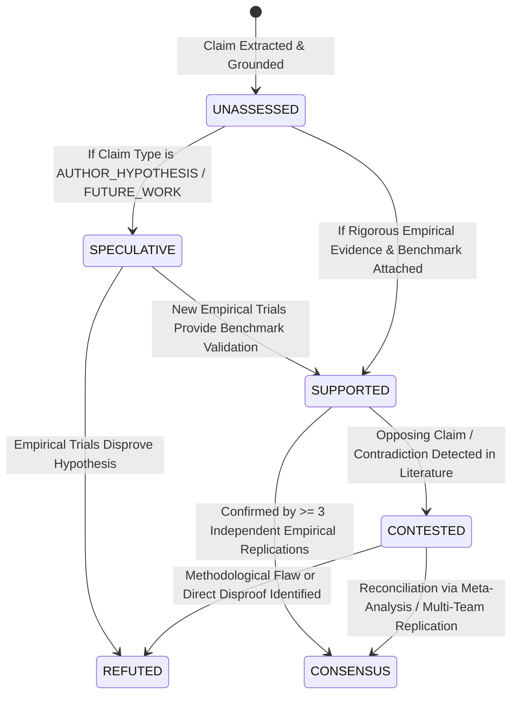

# Intel OS / NCKH Intelligence Platform — Intelligence & Epistemic Model

## 1. Scientific Epistemology & Epistemic Foundations

Scientific inquiry is not a mere accumulation of textual documents; it is a structured, evolving network of claims, empirical evidence, baseline methodologies, contradictions, and consensus shifts.

Intel OS rejects the flawed assumption that textual presence implies scientific truth. The platform enforces a strict separation between four foundational epistemic dimensions:

```
┌─────────────────────────────────────────────────────────────────────────────┐
│                     FOUR EPISTEMIC DIMENSIONS OF INTEL OS                   │
├─────────────────────────────────────────────────────────────────────────────┤
│ 1. Grounding Status (Textual Fidelity)                                      │
│    └── "Did the source document actually state this?"                       │
│    └── Values: UNVERIFIED, VERBATIM_MATCH, PARAPHRASE_VERIFIED, FAILED      │
├─────────────────────────────────────────────────────────────────────────────┤
│ 2. Claim Type (Rhetorical & Scientific Category)                            │
│    └── "What kind of scientific assertion is this?"                         │
│    └── Values: EMPIRICAL_FINDING, AUTHOR_HYPOTHESIS, BACKGROUND_ASSERTION,  │
│                INTERPRETATION, LIMITATION, FUTURE_WORK, OTHER               │
├─────────────────────────────────────────────────────────────────────────────┤
│ 3. Epistemic Status (Scientific Validity & Literature Consensus)            │
│    └── "What is the validated truth-state of this claim in literature?"     │
│    └── Values: UNASSESSED, SUPPORTED, CONTESTED, REFUTED, CONSENSUS,        │
│                SPECULATIVE                                                  │
├─────────────────────────────────────────────────────────────────────────────┤
│ 4. Evidence Quality (Empirical & Methodological Rigor)                      │
│    └── "How rigorous is the empirical benchmark backing this finding?"      │
│    └── Attributes: Dataset openness, sample size, hardware rigor,           │
│                    statistical significance (p-value), baseline ablations   │
└─────────────────────────────────────────────────────────────────────────────┘
```

> [!IMPORTANT]
> **The Grounding Invariant**: Verbatim quote extraction validates only **Grounding Status** (`grounding_status = 'VERBATIM_MATCH'`). It does **not** determine scientific truth. All newly extracted claims default to `epistemic_status = 'UNASSESSED'` until evaluated against empirical evidence, methodology rigor, or cross-publication consensus.

---

## 2. Epistemic Status Lifecycle



| Epistemic Status | Scientific Definition | Transition Condition |
| :--- | :--- | :--- |
| `UNASSESSED` | Default initial state upon extraction. No validity assessment performed. | Assigned on creation. |
| `SUPPORTED` | Grounded claim backed by empirical benchmarks, ablations, and sound methodology. | Associated `evidence_items` meet rigor threshold. |
| `CONTESTED` | Active dispute between peer-reviewed publications. | Record created in `contradictions` table linking opposing claims. |
| `REFUTED` | Empirically disproven, retracted, or invalidated by flawed baselines. | Direct empirical refutation with superior methodology. |
| `CONSENSUS` | Broadly accepted foundational principle across independent teams. | Verified across \(\ge 3\) independent study snapshots. |
| `SPECULATIVE` | Theoretical conjecture, exploratory hypothesis, or untested outlook. | Assigned when claim type is `AUTHOR_HYPOTHESIS` or `FUTURE_WORK`. |

---

## 3. The 3-Tier Intellectual Asset Ontology

```
┌─────────────────────────────────────────────────────────────────────────────┐
│                           ASSET ONTOLOGY TOPOLOGY                           │
├─────────────────────────────────────────────────────────────────────────────┤
│ 1. Intelligence Lake                                                        │
│    └── Discovered entities, multi-provider observations (`document_sources`),│
│        multi-topic mappings (`document_topics`), versioned representations │
│        (`document_snapshots`), and selectively retained raw files (S3).     │
├─────────────────────────────────────────────────────────────────────────────┤
│ 2. Personal Research Memory (The Durable Core)                              │
│    └── Atomic grounded claims, empirical benchmark metrics (`evidence_items`),│
│        claim-to-claim logic relationships (`relationships`), user notes,    │
│        and empirical experiment records (`experiment_logs`).                │
├─────────────────────────────────────────────────────────────────────────────┤
│ 3. Research Opportunity Memory (The Generative Frontier)                    │
│    └── Unresolved research gaps (`research_gaps`), scientific conflicts     │
│        (`contradictions`), opportunity vectors (`research_opportunities`),  │
│        and candidate hypotheses (`research_ideas`) with full Lineage.       │
└─────────────────────────────────────────────────────────────────────────────┘
```

---

## 4. Flagship Requirement: Idea Lineage & Provenance Mechanics

Intel OS guarantees that every generated idea, gap, and synthesis can be traced across bidirectional provenance graphs, pinning the exact source document snapshots that originated the evidence.

### 4.1 Backward Lineage (Audit & Justification)
Answers: *"Why was this research idea synthesized, and from which exact document versions?"*

```text
Research Idea (ID: IDEA-109)
  │
  ├──► Research Gap (ID: GAP-042): "Speculative decoding fails on heterogeneous NPUs"
  │      │
  │      ├──► Claim (ID: CLM-801) [Type: EMPIRICAL_FINDING, Epistemic: SUPPORTED, Grounding: VERBATIM_MATCH]
  │      │      └── Evidence (ID: EVD-304): Table 2 - Latency Breakdown
  │      │            └── Snapshot: arXiv v2 (Hash: e3b0c442...)
  │      │                  └── Document: "Latency Dynamics of Edge Speculation"
  │      │                        └── Source: arXiv cs.AI Feed
  │      │
  │      └──► Claim (ID: CLM-802) [Type: EMPIRICAL_FINDING, Epistemic: SUPPORTED, Grounding: VERBATIM_MATCH]
  │             └── Evidence (ID: EVD-305): Figure 5 - Core Thermal Throttling
  │                   └── Snapshot: Camera-Ready PDF (Hash: 9f83ac12...)
  │                         └── Document: "Thermal Characterization of Edge NPUs"
  │                               └── Source: ACM Digital Library
  │
  └──► Contradiction (ID: CONTR-018): "Memory Bandwidth vs Compute Kernel Dispatch"
         ├── Claim A: "Compute kernel dispatch is primary bottleneck" (Snapshot: MLSys 2024 PDF)
         └── Claim B: "DRAM bandwidth saturation limits scaling" (Snapshot: IEEE Micro 2024 PDF)
```

### 4.2 Forward Lineage (Impact Analysis)
Answers: *"What existing hypotheses or research gaps are impacted when a new paper snapshot is ingested?"*

When a new document snapshot \(S_{new}\) is processed:
1. Extract new claims \(\{C_1, C_2, \dots, C_k\}\).
2. Compare claim embeddings against active `research_ideas`, `research_gaps`, and existing `claims`.
3. If \(C_i\) conflicts with a foundational claim supporting an approved idea, generate an **Impact Alert**:
   > *"Alert: Newly ingested paper snapshot (arXiv:2608.xxxxx v1) challenges baseline claim CLM-801. Idea IDEA-109 feasibility score updated from 0.85 to 0.62."*

---

## 5. Cognitive Memory Evolution & Independence

* **Provider Independence**: Personal Research Memory is represented in pure relational PostgreSQL schemas and standard JSON/vector structures. It does not depend on any proprietary LLM embedding space or conversational context buffer.
* **Snapshot Traceability**: As academic preprints update (e.g. arXiv v1 to v2), new snapshots capture the changes while existing claims maintain historical integrity pinned to the specific snapshot version that produced them.
