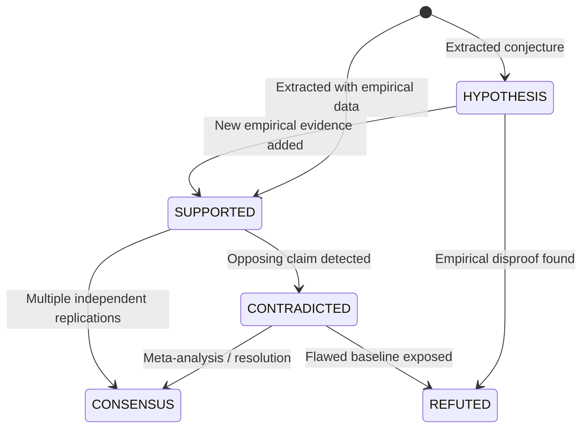

# Intel OS / NCKH Intelligence Platform — Intelligence & Epistemic Model

## 1. Epistemic Foundations

Scientific research is an evolving graph of claims, evidence, hypotheses, and contradictions—not a static sequence of documents. Intel OS formalizes this process through an **Epistemic Intelligence Model** that separates raw observations from validated scientific knowledge.

```
┌─────────────────────────────────────────────────────────────────────────────┐
│                       EPISTEMIC INTELLIGENCE LADDER                         │
├─────────────────────────────────────────────────────────────────────────────┤
│ Level 5: Research Ideas & Blueprints  │ "Adaptive Speculative Decoding"     │
│ Level 4: Research Gaps & Gaps Matrix  │ "Verification latency on NPUs"      │
│ Level 3: Verified Scientific Claims   │ "Fixed lookahead causes 38% stall"  │
│ Level 2: Empirical Evidence Items     │ "Table 3: Latency on Apple A17 NPU" │
│ Level 1: Ingested Source Documents    │ "Paper: arXiv:2403.xxxxx (PDF)"     │
│ Level 0: Raw Discovery Metadata       │ "DOI: 10.48550/arXiv.2403.xxxxx"    │
└─────────────────────────────────────────────────────────────────────────────┘
```

---

## 2. Epistemic Status Taxonomy

Every scientific claim in Intel OS is assigned an explicit epistemic status that evolves as new literature is integrated:



| Epistemic Status | Description | Required Verification Condition |
| :--- | :--- | :--- |
| `HYPOTHESIS` | Theoretical proposition or author assertion. | Stated by author without direct quantitative benchmark. |
| `SUPPORTED` | Grounded claim backed by empirical evidence. | Verified quote + documented experimental setup & metrics. |
| `CONTRADICTED` | Conflict between two peer-reviewed claims. | Dual opposing claims on identical entity/metric pair. |
| `REFUTED` | Disproven or invalidated claim. | Explicit empirical contradiction with superior methodology. |
| `CONSENSUS` | Broadly accepted foundational principle. | Confirmed across \(\ge 3\) independent research teams. |
| `SPECULATION` | Future outlook or exploratory comment. | Found in author discussion / future work section. |

---

## 3. The 3-Tier Intellectual Asset Ontology

Intel OS separates storage and memory into three decoupled ontological tiers:

```
┌─────────────────────────────────────────────────────────────────────────────┐
│                           ASSET ONTOLOGY TOPOLOGY                           │
├─────────────────────────────────────────────────────────────────────────────┤
│ 1. Intelligence Lake                                                        │
│    └── Discovered Entities, Filtered Metadata, Parsed Markdown,             │
│        Selectively Retained Raw Artifacts (PDFs, HTML snapshots).           │
├─────────────────────────────────────────────────────────────────────────────┤
│ 2. Personal Research Memory (Durable Core)                                  │
│    └── Atomic Verified Claims, Empirical Benchmark Evidence,                │
│        Methodology Taxonomies, User Critique Notes, Failed Experiments.     │
├─────────────────────────────────────────────────────────────────────────────┤
│ 3. Research Opportunity Memory (Generative Frontier)                         │
│    └── Unresolved Research Gaps, Active Contradictions,                     │
│        Emerging Trend Trajectories, Candidate Hypotheses & Ideas.           │
└─────────────────────────────────────────────────────────────────────────────┘
```

---

## 4. Flagship Requirement: Idea Lineage & Provenance Mechanics

Intel OS guarantees that every generated idea, gap, and synthesis can be traced across bidirectional provenance graphs.

### 4.1 Backward Traceability (Audit & Justification)
Answers: *"Why was this research idea synthesized?"*

```text
Research Idea (ID: IDEA-109)
  │
  ├──► Research Gap (ID: GAP-042): "Speculative decoding fails on heterogeneous NPUs"
  │      │
  │      ├──► Claim (ID: CLM-801): "Verification latency exceeds draft generation speed"
  │      │      └── Evidence (ID: EVD-304): Table 2 - Latency Breakdown
  │      │            └── Document: arXiv:2403.01234
  │      │                  └── Source: arXiv cs.AI Feed
  │      │
  │      └──► Claim (ID: CLM-802): "Fixed draft lengths create pipeline bubbles"
  │             └── Evidence (ID: EVD-305): Figure 5 - Core Utilization
  │                   └── Document: ACM MobileSys 2024
  │
  └──► Contradiction (ID: CONTR-018): "Memory Bandwidth vs Compute Latency"
         ├── Claim A: "Compute kernel dispatch is primary bottleneck" (MLSys 2024)
         └── Claim B: "DRAM bandwidth saturation limits scaling" (IEEE Micro 2024)
```

### 4.2 Forward Traceability (Impact Analysis)
Answers: *"What existing hypotheses are impacted when this new paper is ingested?"*

When a new document \(D_{new}\) is processed:
1. Extract new claims \(\{C_1, C_2, \dots, C_k\}\).
2. Calculate cosine similarity against all active `research_ideas` and `research_gaps`.
3. If \(C_i\) contradicts a foundational claim of an approved idea, generate an **Impact Alert**:
   > *"Alert: Newly ingested paper (arXiv:2608.xxxxx) challenges baseline claim CLM-801. Idea IDEA-109 feasibility score updated from 0.85 to 0.62."*

---

## 5. Cognitive Memory Evolution & Independence

* **Provider Independence**: Personal Research Memory is represented in pure relational PostgreSQL schemas and standard JSON/vector structures. It does not depend on any proprietary LLM embedding space or conversation buffer.
* **Non-Destructive Evolution**: When an author's understanding changes or a hypothesis is refuted, the historical state is retained with timestamped annotations, preserving the researcher's cognitive journey.
