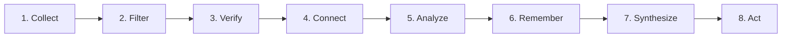

# Intel OS / NCKH Intelligence Platform — Processing Pipeline Specification

## 1. The 8-Stage Intelligence Lifecycle



---

## 2. Detailed Pipeline Stages

### Stage 1: Collect (Multi-Provider Discovery & Ingestion)
* **Goal**: Discover candidates across multiple scientific feeds without unbounded disk usage or duplicate logical records.
* **Identity & Deduplication Precedence**:
  $$\text{DOI} \longrightarrow \text{arXiv ID} \longrightarrow \text{Canonical URL} \longrightarrow \text{Metadata Fingerprint} \longrightarrow \text{Fetched Content Hash}$$
* **Multi-Provider Reconciliation Workflow**:
  1. Ingest connector receives record from arXiv API, Crossref API, or Semantic Scholar.
  2. Normalize canonical identifiers (lowercase DOI, strip URL tracking parameters).
  3. Calculate `metadata_fingerprint = sha256(normalize(title) + normalize(authors) + venue + year)`.
  4. Query `documents` table by DOI, arXiv ID, canonical URL, or `metadata_fingerprint`:
     * **Hard Identity Match** (DOI or arXiv ID): Auto-merge. Record `document_sources` observation with `match_method = 'DOI_EXACT'` / `'ARXIV_ID_EXACT'` and `match_confidence = 1.0`.
     * **Canonical URL Match**: Auto-merge with `match_method = 'CANONICAL_URL'`, `match_confidence = 1.0`.
     * **Metadata Fingerprint Match (Candidate)**: Record observation with `match_method = 'METADATA_FINGERPRINT'` and `match_confidence = 0.7–0.9`. If no hard identity corroborates and titles differ significantly, **preserve as separate documents**. False merge is more dangerous than temporary duplication.
     * **No Match**: Insert new `documents` record with `retention_tier = 'DISCOVERED'`.
  5. Map document to relevant topics via `document_topics` (Many-to-Many).
  6. **Invariant**: No content bytes or PDFs are downloaded at this initial stage.
  7. **Invariant**: Every provider observation is recorded in `document_sources` regardless of merge outcome.

### Stage 2: Filter (Multi-Tier Retention Funnel)
* **Goal**: Selectively promote documents across knowledge tiers.

```text
┌────────────────────────────────────────────────────────────────────────────────┐
│                           RETENTION FUNNEL MATRIX                              │
├────────────────┬────────────────────────────┬──────────────────────────────────┤
│ Tier           │ Storage Location           │ Content Retained                 │
├────────────────┼────────────────────────────┼──────────────────────────────────┤
│ 1. DISCOVERED  │ PostgreSQL `documents`     │ Title, DOI, Authors, Venue, URL  │
│ 2. INDEXED     │ PostgreSQL `documents`     │ Abstract, Keywords, Embeddings   │
│ 3. RELEVANT    │ PostgreSQL `doc_chunks`    │ Parsed Markdown Sections         │
│ 4. RETAINED    │ S3 Object Storage (R2)     │ Raw PDF / HTML Snapshot          │
│ 5. ARCHIVED    │ Cold Storage Archive       │ Periodic Database Dump           │
└────────────────┴────────────────────────────┴──────────────────────────────────┘
```

* **Promotion & Snapshot Creation**:
  * `DISCOVERED → INDEXED`: Abstract fetched via API; heuristic keyword match score \(\ge 0.4\) (provisional). Fast embedding computed.
  * `INDEXED → RELEVANT`: Semantic embedding cosine similarity with active Topic \(\ge 0.65\) (provisional). Document payload downloaded, creating a versioned `document_snapshots` record with `content_hash = sha256(bytes)`.
  * `RELEVANT → RETAINED`: Document cited by \(\ge 2\) existing retained papers OR user explicitly flags OR relevance \(\ge 0.85\) (provisional). Raw PDF uploaded to S3-compatible storage with `raw_s3_key`.

### Stage 3: Verify (Claim Extraction & Grounding Verification)
* **Goal**: Extract atomic scientific claims and verify textual grounding (presence in source text).
* **Mechanism**:
  1. Extract structured sections from the active `document_snapshots` representation.
  2. Pass sections to `LLMGateway` with strict Pydantic extraction schema.
  3. Extraction returns `{ claim_text, normalized_statement, claim_type, quote_verbatim }`.
  4. **Grounding Verification Algorithm**:
     * Search `quote_verbatim` in snapshot text using exact substring matching or Levenshtein distance (\(\le 2\)).
     * If matched, set `grounding_status = 'VERBATIM_MATCH'` and record character offsets (`quote_start_char`, `quote_end_char`).
     * If failed, set `grounding_status = 'FAILED'` and quarantine/discard claim to prevent LLM hallucinations.
  5. **Epistemic Assignment**: Newly grounded claims default to `epistemic_status = 'UNASSESSED'`. (Grounding verifies presence, not scientific truth).

### Stage 4: Connect (Entity Resolution & Contradiction Detection)
* **Goal**: Form the relational knowledge and contradiction graph.
* **Mechanism**:
  1. Normalize scientific entities (e.g., *"Llama-3-8B"*, *"A100 GPU"*, *"Speculative Decoding"*).
  2. Query pgvector for existing claims within cosine distance \(\le 0.2\) (V1 768-dim embedding contract).
  3. LLM evaluates pair for relationship: `SUPPORTS`, `CONTESTS`, `EXTENDS`, or `REFUTES`.
  4. If conflict detected, create record in `contradictions` table linking `claim_a_id` and `claim_b_id` with `severity_score`.

### Stage 5: Analyze (Multi-Factor Scoring)
* **Goal**: Rank and prioritize extracted intelligence.
* **Provisional Scoring Heuristics (Subject to G9 Calibration)**:
  * Source Credibility Prior (\(S_{cred}\)): Metadata heuristic based on venue and citation velocity.
  * Claim Relevance (\(C_{rel}\)): Semantic alignment with active topic.
  * Evidence Quality (\(E_{qual}\)): Methodological rigor, dataset openness, and statistical significance.
  * Research Gap Potential (\(G_{score}\)): Unaddressed limitation frequency and contradiction severity.
  * Composite Priority Score:
    \[\text{Priority} = 0.35 \times C_{rel} + 0.25 \times S_{cred} + 0.25 \times E_{qual} + 0.15 \times G_{score} \quad \text{(Provisional)}\]

### Stage 6: Remember (Personal Research Memory Integration)
* **Goal**: Commit validated insights into durable, LLM-independent storage.
* **Mechanism**:
  1. Transactional SQL insert into `claims`, `evidence_items`, and `relationships`.
  2. Index 768-dimensional embeddings in `claims.embedding` using HNSW.
  3. Update `document_topics` relevance scores and topic state.
  4. Invalidate outdated search cache entries.

### Stage 7: Synthesize (Handbook & Matrix Generation)
* **Goal**: Transform structured memory into researcher-facing artifacts.
* **Outputs**:
  * **SOTA Comparison Matrix**: Dynamic markdown/LaTeX table comparing baseline models, datasets, hardware, and benchmark results.
  * **State of Research Briefing**: Periodic synthesis highlighting newly verified findings.
  * **Scientific Research Handbook**: Formatted survey chapter with verified BibTeX references.

### Stage 8: Act (Opportunity Lineage & Proposal Generation)
* **Goal**: Generate actionable research hypotheses with complete provenance.
* **Mechanism**:
  1. Opportunity Miner correlates `research_gaps` with `contradictions` and keyword momentum.
  2. Generates candidate `research_ideas` with estimated resource cost and semantic distinctiveness score.
  3. Writes `idea_provenance` records linking idea to specific gap, claims, documents, and snapshot versions.
  4. Presents candidate idea to researcher in Workbench for approval.

---

## 3. Four-Tier Idempotency & Fault Isolation Model

```
┌────────────────────────────────────────────────────────────────────────────────┐
│                      FOUR-TIER IDEMPOTENCY ARCHITECTURE                       │
├─────────────────────┬──────────────────────────────────────────────────────────┤
│ Identity Layer      │ Uniqueness & Reconciled Guarantee                        │
├─────────────────────┼──────────────────────────────────────────────────────────┤
│ 1. Document Identity│ Canonical DOI / arXiv ID / `metadata_fingerprint`        │
│ 2. Provider Observ. │ Unique `(document_id, source_id, provider_doc_id)`       │
│ 3. Snapshot Identity│ Unique `(document_id, version_identifier)` + byte hash   │
│ 4. Task / Job State │ Deterministic `idempotency_key = sha256(type + payload)` │
└─────────────────────┴──────────────────────────────────────────────────────────┘
```
