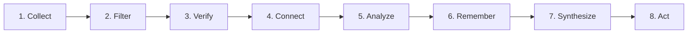

# Intel OS / NCKH Intelligence Platform — Processing Pipeline Specification

## 1. The 8-Stage Intelligence Lifecycle



---

## 2. Detailed Pipeline Stages

### Stage 1: Collect (Discovery & Ingestion)
* **Goal**: Discover candidates across multiple scientific feeds without unbounded disk usage.
* **Mechanism**:
  1. Scheduled cron triggers connector polling (arXiv API, Semantic Scholar API, Crossref).
  2. Input URLs/DOIs are normalized to canonical formats.
  3. SHA-256 hash of metadata computed.
  4. If hash exists in `documents` table, skip redundant processing (Idempotency Key: `sha256(canonical_url)`).
  5. Save initial record with `retention_tier = 'DISCOVERED'`.

### Stage 2: Filter (Multi-Tier Retention Funnel)
* **Goal**: Selectively promote documents across knowledge tiers.

```text
┌────────────────────────────────────────────────────────────────────────┐
│                        RETENTION FUNNEL MATRIX                         │
├────────────────┬────────────────────────────┬──────────────────────────┤
│ Tier           │ Storage Location           │ Content Retained         │
├────────────────┼────────────────────────────┼──────────────────────────┤
│ 1. DISCOVERED  │ PostgreSQL `documents`     │ Title, DOI, Authors, URL │
│ 2. INDEXED     │ PostgreSQL `documents`     │ Abstract, Keywords, Embed│
│ 3. RELEVANT    │ PostgreSQL `doc_chunks`    │ Parsed Markdown Sections │
│ 4. RETAINED    │ S3 Object Storage (R2)     │ Raw PDF / HTML Snapshot  │
│ 5. ARCHIVED    │ Cold Storage Archive       │ Periodic Database Dump   │
└────────────────┴────────────────────────────┴──────────────────────────┘
```

* **Promotion Rules**:
  * `DISCOVERED → INDEXED`: Abstract fetched via API; heuristic keyword match score \(\ge 0.4\).
  * `INDEXED → RELEVANT`: Semantic embedding cosine similarity with active Topic \(\ge 0.65\).
  * `RELEVANT → RETAINED`: Document cited by \(\ge 2\) existing retained papers OR user explicitly flags OR relevance \(\ge 0.85\). Raw PDF uploaded to S3.

### Stage 3: Verify (Claim & Evidence Grounding)
* **Goal**: Extract atomic scientific claims and enforce 100% quote grounding.
* **Mechanism**:
  1. Split parsed markdown text into semantic sections.
  2. Pass sections to `LLMGateway` with strict Pydantic extraction schema.
  3. Extraction returns `{ claim_text, normalized_statement, quote_verbatim }`.
  4. **Grounding Verification Algorithm**:
     * Search `quote_verbatim` in source section text using exact substring matching or Levenshtein distance (\(\le 2\)).
     * If quote does not exist in source text, discard claim as hallucination.
     * Record character offsets (`quote_start_char`, `quote_end_char`).
  5. Assign initial `epistemic_status = 'SUPPORTED'`.

### Stage 4: Connect (Entity Resolution & Contradiction Detection)
* **Goal**: Form the relational knowledge graph.
* **Mechanism**:
  1. Normalize scientific entities (e.g., *"Llama-3-8B"*, *"A100 GPU"*, *"Speculative Decoding"*).
  2. Query pgvector for existing claims within cosine distance \(\le 0.2\).
  3. LLM evaluates pair for relationship: `SUPPORTS`, `CONTRADICTS`, `EXTENDS`, or `REFUTES`.
  4. If contradiction detected, create record in `contradictions` table with `severity_score`.

### Stage 5: Analyze (Multi-Factor Scoring)
* **Goal**: Rank and prioritize extracted intelligence.
* **Formula**:
  * Source Credibility (\(S_{cred}\))
  * Claim Relevance (\(C_{rel}\))
  * Evidence Rigor (\(E_{qual}\))
  * Research Gap Potential (\(G_{score}\))
  * Composite Priority Score:
    \[Priority = 0.35 \times C_{rel} + 0.25 \times S_{cred} + 0.25 \times E_{qual} + 0.15 \times G_{score}\]

### Stage 6: Remember (Personal Research Memory Integration)
* **Goal**: Commit validated insights into durable, LLM-independent storage.
* **Mechanism**:
  1. Transactional SQL insert into `claims`, `evidence_items`, and `relationships`.
  2. Generate 768-dimensional embeddings and index in `claims.embedding` using HNSW.
  3. Update Topic state and keyword graph.
  4. Invalidate outdated search cache entries.

### Stage 7: Synthesize (Handbook & Matrix Generation)
* **Goal**: Transform structured memory into researcher-facing artifacts.
* **Outputs**:
  * **SOTA Comparison Matrix**: Dynamic markdown/LaTeX table comparing baseline models, datasets, hardware, and benchmark results.
  * **State of Research Briefing**: Periodic synthesis highlighting newly verified findings.
  * **Scientific Research Handbook**: Formatted survey chapter with verified BibTeX references.

### Stage 8: Act (Opportunity Lineage & Proposal Generation)
* **Goal**: Generate actionable research hypotheses with complete provenance.
* **Mechanism**:
  1. Opportunity Miner correlates `research_gaps` with `contradictions` and `emerging_trends`.
  2. Generates candidate `research_ideas` with estimated resource cost and novelty scores.
  3. Writes `idea_provenance` records linking idea to specific gap, claims, and papers.
  4. Presents candidate idea to researcher in Workbench for approval.

---

## 3. Idempotency & Failure Recovery Guarantees

```
┌────────────────────────────────────────────────────────────────────────┐
│                      IDEMPOTENCY & ERROR RECOVERY                      │
├─────────────────────┬──────────────────────────────────────────────────┤
│ Component           │ Guarantee Mechanism                              │
├─────────────────────┼──────────────────────────────────────────────────┤
│ Document Ingestion  │ Unique constraint on `content_hash` (SHA-256)    │
│ Chunk Indexing      │ Unique constraint on `(document_id, chunk_index)`│
│ Background Task     │ Deterministic `idempotency_key` per payload      │
│ API Rate Limiting   │ Token Bucket algorithm with exponential backoff  │
│ Dead-Letter Queue   │ Max 3 retries before quarantine to DLQ           │
└─────────────────────┴──────────────────────────────────────────────────┘
```
