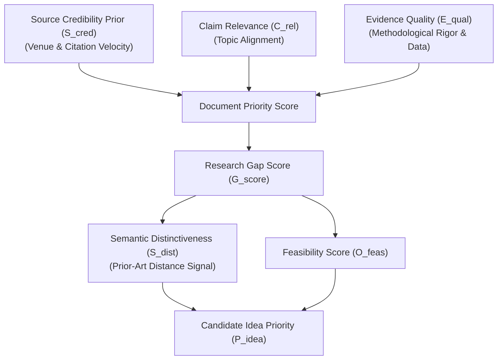

# Intel OS / NCKH Intelligence Platform — Multi-Factor Scoring Model

> [!IMPORTANT]
> **Status of Constants & Formulas**: All mathematical formulations, parameter weights (\(w_v, w_c, \alpha, \beta, \gamma\)), and numerical thresholds in this document are **PROVISIONAL, UNVALIDATED HEURISTICS**. They represent the baseline architectural scaffolding and **REQUIRE EMPIRICAL CALIBRATION & BENCHMARKING IN GATE 9**.

---

## 1. Scoring Architecture Overview

Intel OS employs a multi-factor heuristic framework to prioritize documents, verify claim grounding, estimate semantic distinctiveness, and surface high-potential research opportunities.

---

## 2. Mathematical Formulations & Signals

### 2.1 Source Credibility Prior (\(S_{cred} \in [0.0, 1.0]\) — Provisional)
Measures the historical publication venue standing and citation velocity. This serves as an **ingestion routing prior**, NOT direct proof of the factual truth of any individual scientific claim.

\[S_{cred} = w_v V_{score} + w_c \min\left(1.0, \frac{\log_{10}(C_{total} + 1)}{4}\right) + w_a A_{rep} \quad \text{[PROVISIONAL]}\]

Where:
* \(V_{score}\): Publication venue weight (e.g., Top-tier conference/journal = 1.0; Workshop/arXiv = 0.7; Generic Web = 0.3).
* \(C_{total}\): Total citation count from Crossref / Semantic Scholar.
* \(A_{rep}\): Author h-index / institutional reputation factor (\(0.0 \le A_{rep} \le 1.0\)).
* Provisional default weights: \(w_v = 0.50, w_c = 0.35, w_a = 0.15\) (subject to calibration).

---

### 2.2 Claim Relevance Score (\(C_{rel} \in [0.0, 1.0]\) — Provisional)
Quantifies semantic alignment between an extracted claim and an active research Topic:

\[C_{rel} = \alpha \cdot \text{CosineSim}(\vec{e}_{claim}, \vec{e}_{topic}) + (1 - \alpha) \cdot \text{LexicalMatch}(T_{keywords}, C_{text}) \quad \text{[PROVISIONAL]}\]

Where:
* \(\vec{e}_{claim}, \vec{e}_{topic}\): 768-dimensional pgvector embeddings (V1 contract).
* \(\text{LexicalMatch}\): Normalized PostgreSQL full-text search match score across topic focus keywords.
* Provisional parameter: \(\alpha = 0.70\).

---

### 2.3 Evidence Quality Score (\(E_{qual} \in [0.0, 1.0]\) — Provisional)
Evaluates the empirical completeness and methodological rigor of supporting evidence items:

\[E_{qual} = \frac{1}{4} \left( M_{rigor} + D_{open} + S_{stat} + R_{comp} \right) \quad \text{[PROVISIONAL]}\]

Where:
* \(M_{rigor}\): Baseline model comparisons and ablation studies present \(\in [0, 1]\).
* \(D_{open}\): Dataset openness (Public standard benchmark = 1.0; Private/unreleased dataset = 0.3).
* \(S_{stat}\): Statistical significance reported (p-values, confidence intervals, multi-seed trials) \(\in [0, 1]\).
* \(R_{comp}\): Reproducibility indicators (code repository linked, hyperparameters specified) \(\in [0, 1]\).

---

### 2.4 Research Gap Score (\(G_{score} \in [0.0, 1.0]\) — Provisional)
Calculates the significance and unaddressed potential of an identified research gap:

\[G_{score} = \beta \cdot F_{mention} + \gamma \cdot C_{intensity} + (1 - \beta - \gamma) \cdot (1 - S_{saturation}) \quad \text{[PROVISIONAL]}\]

Where:
* \(F_{mention}\): Frequency of limitation across recent papers in the topic cluster.
* \(C_{intensity}\): Severity of contradictions associated with this limitation.
* \(S_{saturation}\): Topic solution saturation (number of existing proposed solutions).
* Provisional parameters: \(\beta = 0.45, \gamma = 0.35\).

---

### 2.5 Semantic Distinctiveness Signal & Feasibility

#### Semantic Distinctiveness Signal (\(S_{dist} \in [0.0, 1.0]\) — Provisional)
Measures the vector distance between a candidate idea and retrieved prior art in the active Topic:

\[S_{dist} = 1.0 - \max_{c \in \text{RetrievedClaims}} \left( \text{CosineSim}(\vec{e}_{idea}, \vec{e}_c) \right) \quad \text{[PROVISIONAL]}\]

> [!NOTE]
> **Distinction Between Semantic Distance and True Scientific Novelty**:
> Embedding distance is an initial **retrieval-based distinctiveness signal**, not full scientific novelty. Comprehensive novelty assessment requires evaluating:
> 1. Problem formulation uniqueness vs known literature.
> 2. Methodological mechanism differences (ablation comparisons).
> 3. Dataset/domain transfer novelty.
> 4. Human-in-the-loop expert review.

#### Feasibility Score (\(O_{feas} \in [0.0, 1.0]\) — Provisional)
Evaluates resource, compute, and data constraints:

\[O_{feas} = 1.0 - \left( 0.4 \cdot C_{compute} + 0.3 \cdot D_{barrier} + 0.3 \cdot E_{complexity} \right) \quad \text{[PROVISIONAL]}\]

Where:
* \(C_{compute}\): Estimated GPU compute demand (1.0 = >10k GPU-hours; 0.1 = Single workstation).
* \(D_{barrier}\): Proprietary data dependency (1.0 = Unavailable; 0.0 = Standard open benchmark).
* \(E_{complexity}\): Implementation and theoretical engineering complexity.

---

## 3. Composite Candidate Idea Priority

The provisional composite ranking formula for prioritizing candidate research ideas in the researcher's Workbench:

\[\text{Priority}_{idea} = 0.40 \cdot S_{dist} + 0.35 \cdot O_{feas} + 0.25 \cdot G_{score} \quad \text{[PROVISIONAL]}\]

### Human-in-the-Loop Calibration
* All automated scores provide initial sorting heuristics only.
* Researchers have the authority to override scores, re-weight topic priorities, or reject candidate proposals.
* Ground truth user feedback will be used in Gate 9 to fit regression weights and calibrate scoring models against real-world scientific impact.
