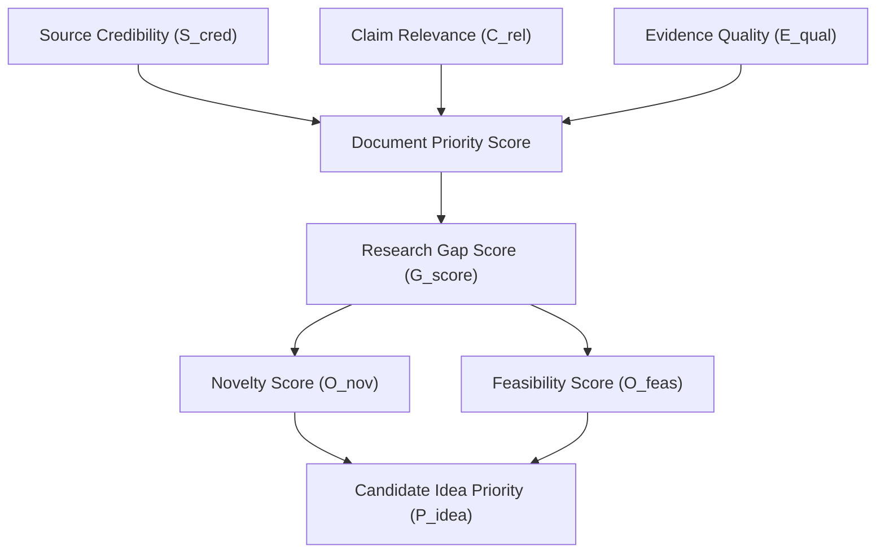

# Intel OS / NCKH Intelligence Platform — Multi-Factor Scoring Model

## 1. Scoring Architecture Overview

Intel OS uses a deterministic, multi-factor scoring model to evaluate and prioritize scientific documents, claims, research gaps, and candidate ideas.

---

## 2. Mathematical Formulations

### 2.1 Source Credibility Score (\(S_{cred} \in [0.0, 1.0]\))
Measures the institutional rigor, peer review standing, and publication authority of a scientific source:

\[S_{cred} = w_v V_{score} + w_c \min\left(1.0, \frac{\log_{10}(C_{total} + 1)}{4}\right) + w_a A_{rep}\]

Where:
* \(V_{score}\): Publication venue weight (e.g., Top-tier conference / Journal = 1.0; Workshop / arXiv = 0.7; Generic Web = 0.3).
* \(C_{total}\): Total citation count from Crossref / Semantic Scholar.
* \(A_{rep}\): Author h-index / institutional reputation factor (\(0.0 \le A_{rep} \le 1.0\)).
* Default weights: \(w_v = 0.50, w_c = 0.35, w_a = 0.15\).

---

### 2.2 Claim Relevance Score (\(C_{rel} \in [0.0, 1.0]\))
Quantifies semantic alignment between an extracted claim and an active research Topic:

\[C_{rel} = \alpha \cdot \text{CosineSim}(\vec{e}_{claim}, \vec{e}_{topic}) + (1 - \alpha) \cdot \text{BM25}_{norm}(T_{keywords}, C_{text})\]

Where:
* \(\vec{e}_{claim}, \vec{e}_{topic}\): 768-dimensional pgvector embeddings.
* \(\text{BM25}_{norm}\): Normalized keyword match score across topic focus terms.
* Parameter: \(\alpha = 0.70\).

---

### 2.3 Evidence Quality Score (\(E_{qual} \in [0.0, 1.0]\))
Evaluates the empirical strength and reproducibility of supporting evidence:

\[E_{qual} = \frac{1}{4} \left( M_{rigor} + D_{open} + S_{stat} + R_{comp} \right)\]

Where:
* \(M_{rigor}\): Methodology completeness (baseline models present, ablation studies conducted) \(\in [0, 1]\).
* \(D_{open}\): Dataset openness (Public standard benchmark = 1.0; Private dataset = 0.3).
* \(S_{stat}\): Statistical significance reported (p-value, error bars, multi-seed trials) \(\in [0, 1]\).
* \(R_{comp}\): Reproducibility indicators (code repository linked, hyperparameter details included) \(\in [0, 1]\).

---

### 2.4 Research Gap Score (\(G_{score} \in [0.0, 1.0]\))
Calculates the significance and unaddressed potential of an identified research gap:

\[G_{score} = \beta \cdot F_{mention} + \gamma \cdot C_{intensity} + (1 - \beta - \gamma) \cdot (1 - S_{saturation})\]

Where:
* \(F_{mention}\): Frequency of limitation across recent papers in the topic cluster.
* \(C_{intensity}\): Severity of contradictions associated with this limitation.
* \(S_{saturation}\): Topic solution saturation (number of existing proposed solutions).
* Default parameters: \(\beta = 0.45, \gamma = 0.35\).

---

### 2.5 Opportunity Novelty & Feasibility Scores

#### Novelty Score (\(O_{nov} \in [0.0, 1.0]\))
Measures the semantic distance of a candidate idea from all existing literature in the Topic:

\[O_{nov} = 1.0 - \max_{c \in \text{Claims}} \left( \text{CosineSim}(\vec{e}_{idea}, \vec{e}_c) \right)\]

#### Feasibility Score (\(O_{feas} \in [0.0, 1.0]\))
Evaluates the estimated resource, compute, and data requirements against typical academic constraints:

\[O_{feas} = 1.0 - \left( 0.4 \cdot C_{compute} + 0.3 \cdot D_{barrier} + 0.3 \cdot E_{complexity} \right)\]

Where:
* \(C_{compute}\): Estimated GPU compute demand (1.0 = >10k GPU-hours; 0.1 = Single workstation).
* \(D_{barrier}\): Proprietary data dependency (1.0 = Unavailable; 0.0 = Standard open dataset).
* \(E_{complexity}\): Implementation and theoretical complexity.

---

## 3. Composite Candidate Idea Priority

The final composite ranking score for proposing a research idea to the researcher:

\[\text{Priority}_{idea} = 0.40 \cdot O_{nov} + 0.35 \cdot O_{feas} + 0.25 \cdot G_{score}\]

### Calibration & Human Overrides
* Researchers can calibrate weight parameters (\(w_v, \alpha, \beta\)) per Topic via configuration.
* Manual user review scores permanently override automated heuristic values in the database.
